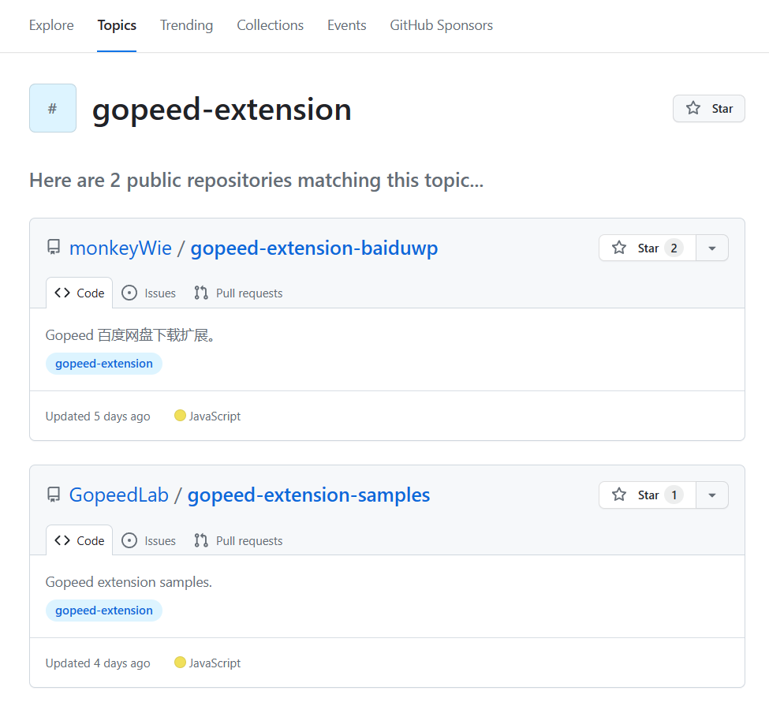
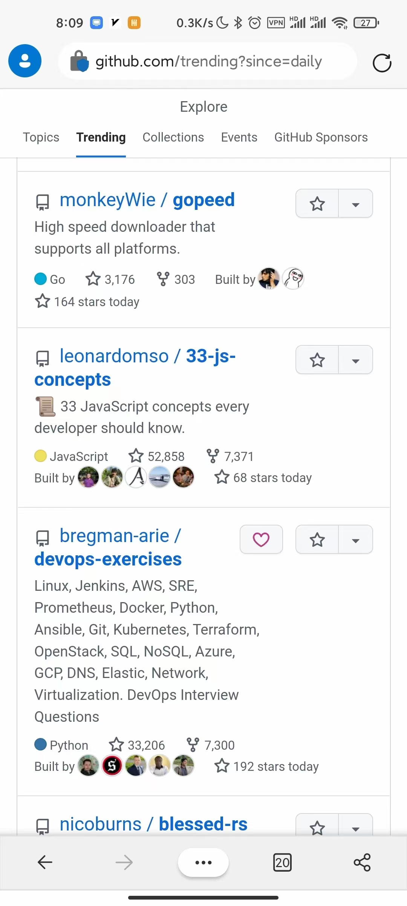

## 前言

经过近三年的迭代，[Gopeed](https://github.com/GopeedLab/gopeed) 终于迎来了我觉得比较满意的一个版本 `v1.4.3`，早在 [proxyee-down](https://github.com/proxyee-down-org/proxyee-down) 停更的时候，我就立下了一个`flag`要用 Golang 来重写一个下载器：


当时刚接触 Golang 就被深深吸引了，它优秀的网络编程、协程和交叉编译等特性，不经感叹这简直就是开发下载器的天选编程语言，于是就有了这个项目，刚开始的时候想着就做一个类似`aria2`这样的命令行工具，后来`flutter`异军突起，我就一直在调研用`flutter`来开发一个支持所有平台的下载器的可行性，一开始`flutter desktop`还不是很成熟，我甚至有考虑过用`electron`做桌面端，`flutter`做移动端，后来`flutter 2.0`发布之后，`flutter desktop`也正式发布了，测了下基本没啥大坑，觉得这是一个很好的机会，就开始把命令行工具改造成`GUI`，更方便用户使用，最终不出所望，通过 Golang + flutter 的组合，实现了一个支持所有平台的下载器。

> 相关链接：
> 官网 -> [https://gopeed.com](https://gopeed.com)
> Github -> [https://github.com/GopeedLab/gopeed](https://github.com/GopeedLab/gopeed)

<!-- more -->

## 特性

先来简单的介绍一下 Gopeed 的特性：

- 支持所有平台，包括`windows`、`mac`、`linux`、`android`、`ios`、`web`、`docker`、`命令行工具`。
- 同时支持 HTTP(S) / BT / 磁力链 多种下载协议，并且后续会支持更多的下载协议。
- 支持多协程下载，支持断点续传。
- 支持暗黑模式和国际化。
- 对外开放`HTTP API`，方便定制化开发。
- 去中心化的扩展系统，可以通过扩展来实现更多的功能，例如：某某网盘下载、某某网站视频下载等等。

### 扩展系统

为什么说新版本是令我满意的呢？正是因为新版本更新的扩展系统，这意味着用户可以通过扩展来实现更多的功能，例如：某某网盘下载、某某网站视频下载等等，先看两个例子：

- B 站视频下载扩展：


- 百度网盘下载扩展：


以上两个扩展都是通过`JavaScript`来开发的，具体的设计草案可以在[这里](https://github.com/GopeedLab/gopeed/issues/107)查看。

基于`git`去中心化和远程仓库的特性，用户只需要输入一个链接地址，即可安装扩展，并且是扩展也是全平台支持的，这样的扩展系统是不是很酷？

这里有人可能会问了，去中心化的扩展系统要怎么找到扩展呢？这里巧妙利用 `Github Topic`功能，只要给你的扩展项目仓库打上`gopeed-extension`的主题标签，然后通过[topics/gopeed-extension](https://github.com/topics/gopeed-extension)就可以找到所有的扩展了：



## 开放生态

Gopeed 目前开放了两种方式来进行定制化开发：

1. 通过对接 HTTP API
2. 通过 `JavaScript` 脚本开发扩展进行增强

Gopeed 的愿景是打造一个丰富的扩展生态，上面的示例只是抛砖引玉，希望有更多感兴趣的开发者参与进来，一起来丰富 Gopeed 的扩展生态。

### 配套设施

为了更方便的用户参与到 Gopeed 的生态开发，我还开发了一个配套`JavaScript`库，开源在：[gopeed-js](https://github.com/GopeedLab/gopeed-js)。

项目使用`TypeScript`+`Rollup`+`pnpm workspace`技术栈，目前已经实现了以下功能：

- create-gopeed-ext：脚手架工具，可以快速的创建一个扩展项目，详细文档可以在[这里](https://docs.gopeed.com/zh/dev-extension.html#%E5%BF%AB%E9%80%9F%E5%BC%80%E5%A7%8B)查看，使用示例：

  ```
  npx create-gopeed-ext@latest

  √ Project name (gopeed-extension-demo) ...
  √ Choose a template » Webpack

  Success! Created gopeed-extension-demo at D:\code\study\js\gopeed-extension-demo
  Inside that directory, you can run several commands:

    git init
      Initialize git repository

    npm install
      Install dependencies

    npm run dev
      Compiles and hot-reloads for development.

    npm run build
      Compiles and minifies for production.

  We suggest that you begin by typing:

    cd gopeed-extension-demo

  Happy coding!
  ```

- @gopeed/rest: 可以方便的通过 js 调用 Gopeed 的`HTTP API`，详细文档可以在[这里](https://docs.gopeed.com/zh/dev-api.html)查看，使用示例：

  ```js
  import { Client } from "@gopeed/rest";

  (async function () {
    // 创建客户端
    const client = new Client();
    // 调用API创建任务
    const res = await client.createTask({
      req: {
        url: "https://example.com/file.zip",
      },
    });
  })();
  ```

### 开发文档

除了`JavaScript`库之外，还贴心的提供了[RESTFul API](https://docs.gopeed.com/site/openapi/index.html)文档和[SDK Reference](https://docs.gopeed.com/site/reference/index.html)文档，提供给用户查阅。

## 接下来的计划

目前呼声很高的是开发`浏览器扩展`用于接管浏览器的下载，所以目前优先级会是最高的。

未来还会支持更多的特性，例如：

- 边下边播
- DLNA 投屏
- 更丰富的扩展生命周期
- ...

## 最后

感谢期间国内外小伙伴们提交的`PR`和`Issue`，也很开心今年因为 Gopeed 又登顶了 GitHub Trending：



截止到目前为止，Gopeed 已经有 7.3k+ 的 star，希望能继`proxyee-down`之后，再拿下一个 10k+ 的 star 的项目。

最后的最后如果你对 Gopeed 感兴趣，欢迎加入我们的开源社区共同建设！
