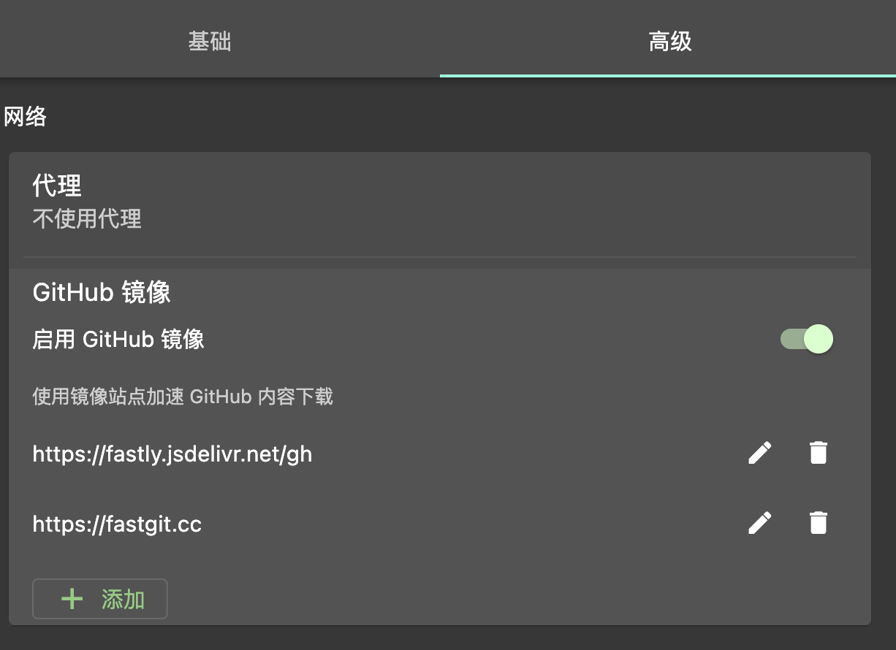
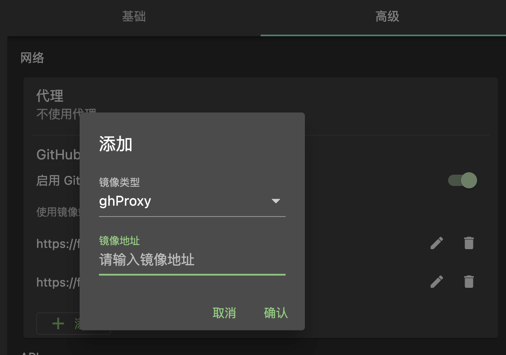
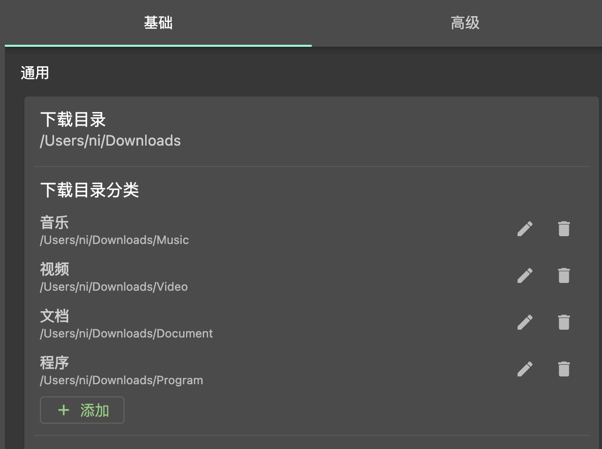
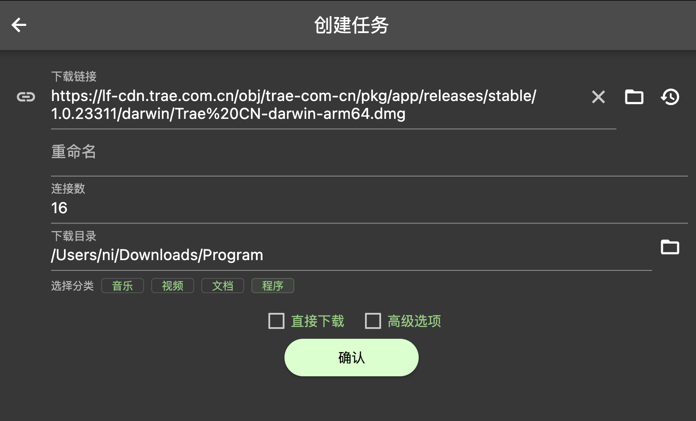
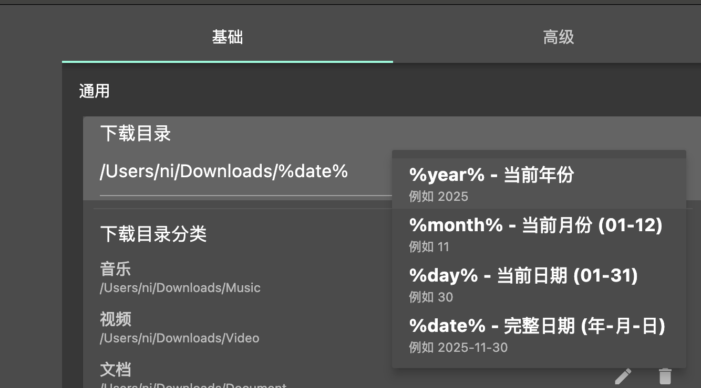
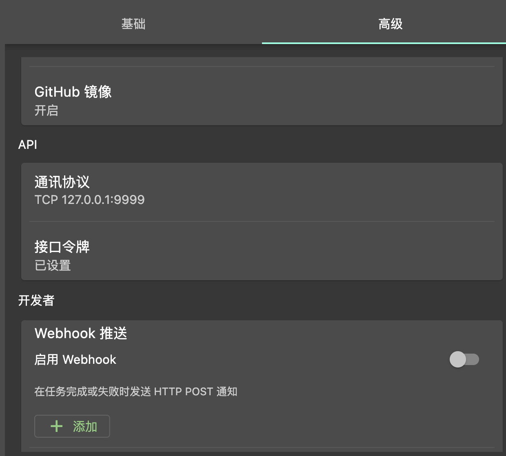
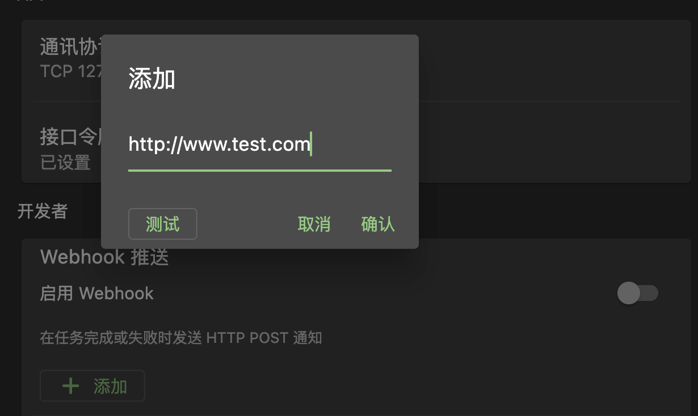

## 👋 哈喽，家人们！

久等了！真的久等了！

其实从 Gopeed 发布到现在，一直有都有用户在问：“有没有国内的交流群？”、“GitHub 访问太慢了怎么办？”、“有没有官方公众号？”... 但是我这个人有亿点点佛系，怕被催更，所以就一直拖到现在才行动。

**听劝！我们来了！** 🙋‍♂️

为了让大家能更方便地找到组织，我们正式开通了 **「Gopeed 官方公众号」**，当然这是通过我个人账号申请的公众号，后续也会分享一些其它干货内容。

以后这里就是咱们的 **“国内大本营”** 了！
所有版本更新的解读、独家使用技巧、硬核技术分享，都会第一时间在这里 **首发**。
别犹豫，**关注不迷路**，上车就对了！🚗💨

---

## v1.8.3 版本更新

说回正题，这次带来的 v1.8.3 版本，更新了许多实用功能和修复了不少 Bug，下面来快速浏览一下更新内容。

### 新特性

#### 支持自定义 GitHub 镜像配置

众所周知, Gopeed 是一个极度依赖 GitHub 的软件，里面的`BT tracker`、`扩展`、`更新`等功能都需要访问 GitHub，之前`Gopeed`中其实已经内置了一些常用的 GitHub 镜像源，但是这些镜像源并不一定都稳定可用，而且最可恶的是有些镜像源访问会被防火墙拦截警告，导致用户以为中病毒了，另外内置的话就只能等下个版本更新才能更换，所以这次决定直接开放自定义 GitHub 镜像源配置，让用户支持自定义配置，不过目前仍然内置了两个镜像源：

- jsdelivr
- fastgit

这两个镜像源相对来说比较稳定，大家可以根据自己的网络环境选择使用，可以在 `设置 -> 高级 -> GitHub 镜像源` 中进行配置：

> `jsdelivr`这种镜像只支持源码文件，只能用来更新`BT tracker`，现在市面上比较流行的基本都是`ghProxy`系列的镜像，这种镜像支持所有 GitHub 资源，包括`Release`资源，可以用来更新，至于`Github`镜像站点怎么找，以后单独写一篇文章来讲。

#### 支持 rpm 包安装

此功能由社区小伙伴 `@BerryMC` 贡献，非常感谢！

现在 Gopeed 支持通过 rpm 包进行安装了，适用于基于 rpm 的 Linux 发行版，例如：`Fedora`、`CentOS`、`openSUSE` 等，有需要的用户可以前往`Github Release`页面下载使用。

#### 添加下载目录分类和占位符支持

这个下载目录相关的功能社区呼声一直很高，我本来想着等到 v2.0 新UI大版本再加上的，但是新版本一直鸽着没出，实在不好意思了，就先加上这个功能。

目前内置了几个常用的分类，然后支持自定义设置：

然后在创建任务的时候可以快速选择分类：

目前还没有实现根据下载的文件类型自动选择分类目录，后面会考虑加上这个功能。

然后就是`占位符`了，也就是用户提到的`FDM`里那个叫宏的东西，目前仅支持一些日期相关的占位符，后续有需求的话可以继续扩展：

这样下载目录就会动态的根据占位符来生成了，比如：`/Downloads/%date%` 会被解析成 `/Downloads/2025-11-30`，另外分类目录也是支持占位符的，这样就可以实现更灵活的目录管理了。

#### 支持 Webhook 推送

作为市面上`扩展性`和`可玩性`最强的下载器，怎么能少的了`Webhook`功能呢，有了这个功能就可以实现更多的自动化操作了，比如：下载完成后通知`Telegram`、`Discord`、`企业微信`等，配合`RESTFul API`，应该可以实现更多有趣的玩法，就等社区的大佬们来挖掘了。

在`设置 -> 高级 -> Webhook` 中可以进行配置：

在添加 Webhook 的时候可以选择测试来验证配置是否正确，验证的时候会发送一个测试的 JSON 数据过去，然后在收到`HTTP 200`响应后表示测试成功，方便用户调试。

#### 支持 Waterfox 浏览器

只能说又在用户这里学到了，这次是`Waterfox`，一个基于`Firefox`的浏览器，主打隐私保护和性能优化，这次的更新中添加了对`Waterfox`浏览器的支持，以便在安装浏览器扩展之后开箱即用，拦截下载。

### Bug 修复

#### HTTP 文件名解析不正确问题

这个问题真的是修了又修，只能说`HTTP`协议真是屎山堆积，各种标准不统一，这次又新增了两个标准的解析，分别是：

- `Content-Disposition` 头中出现多个`filename`字段的处理
- `Content-Disposition` 头中`filename`字段由GBK编码传输的情况

另外我宣布，修完这一次之后，肯定不会再出现中文文件名解析错误的问题了，如果还有公众号抽个键盘助助兴！

#### 代理设置无法保存用户名和密码问题

这是一个低级 Bug，竟然连着好几个版本都没发现，这次光速修复了，感谢社区小伙伴的反馈！

#### 下载同名且没有后缀的情况下不自动重命名问题

该 Bug 由社区小伙伴 `@Little-King2022` 反馈和自行 PR 修复，非常优秀！

当然由于`Gopeed`设计问题，目前会存在待下载的重名文件任务在并发下载时，仍然可能会出现重名覆盖的问题，这个问题会在下个版本中彻底修复。

## 🤝 最后的碎碎念

后续我们会在这里分享更多好玩、硬核的内容，感谢大家一路以来的支持，Gopeed 因为有你们才更好！

我们下个版本见！👋