Gopeed v1.9.0 终于发布了！这个版本包含了很多新功能和优化，下面来快速介绍一下主要更新内容。

---

## v1.9.0 主要更新

### 新特性

#### HTTP 下载全面重构 (PR #1229)

关于这次重构，我之前在 [大刀阔斧，彻底重构 Gopeed HTTP 下载实现](/posts/gopeed-http-download-rewrite) 里写过详细的介绍。主要是解决`HTTP`下载的稳定性和速度问题，顺便还掉了点技术债。

这次要解决的都是用户经常反馈的问题：

- 下载老是失败，要手动重试好几次
- 下载卡在 99% 不动了

#### 支持自动解压 (PR #1212, #1217, #1222, #1227)

现在下载完成后可以自动解压了。为了避免多个任务同时解压把磁盘和 CPU 干爆，做了解压队列。还支持分卷压缩包，UI 上也能看到解压状态。功能默认关闭，需要的话可以在设置里打开：

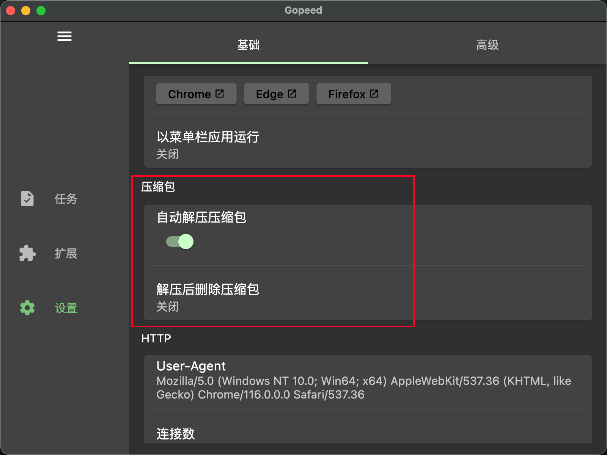

任务完成后会自动开始解压，状态可以在 UI 上看到：

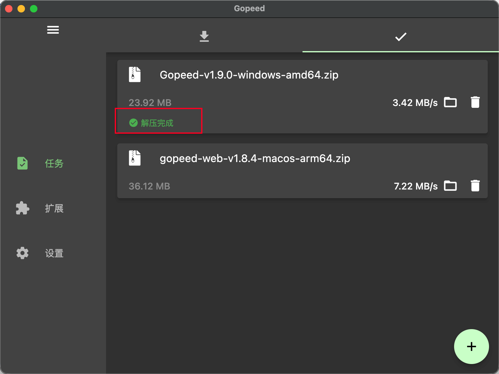

> 感谢来自社区的贡献者 `@ilteoood`，一口气提交了 4 个相关的 PR。

#### 下载进度百分比及预计剩余时间显示 (PR #1238)

现在任务列表里能看到下载百分比和预计剩余时间了。移动端 UI 空间有限，所以目前只在桌面端显示：


本来打算放到新 UI 里做的，但既然用户主动贡献了 PR，那当然要合进来。顺便放两张新 UI 的谍照：

- 桌面端:

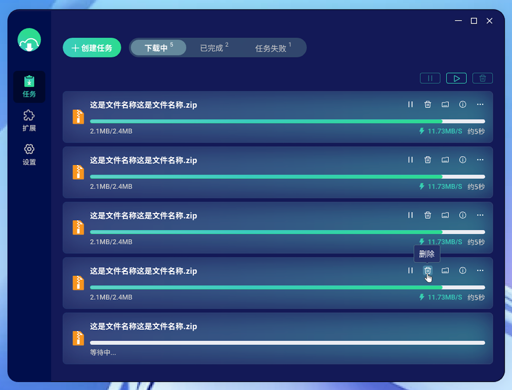

- 移动端：

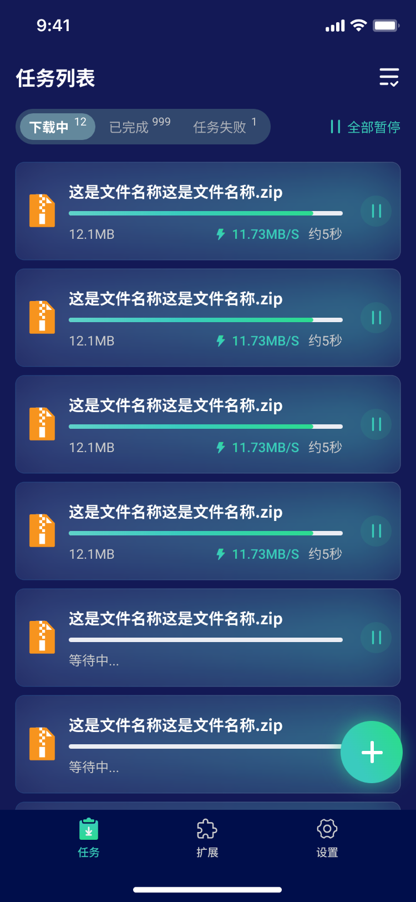

> 感谢来自社区的贡献者 `@Locon213`。吐槽一下，新 UI 鸽了好久，平常上班太忙，周末又都拿去钓鱼了😂。今年下载器基础建设完善后，新 UI 必须安排上！

#### 注册为安卓系统级下载器 (PR #1251)

这个需求之前有不少用户提过，但我对安卓原生开发不太熟。早期用 Google 搜了一圈没找到方案，用`Claude Sonnet 4.5`试了也没解决，后来换`Claude Opus 4.5`总算搞定了，不愧是最强编程大模型！

现在在安卓端用浏览器下载文件时，如果浏览器支持第三方下载器（比如 Firefox），就能选 Gopeed 了：

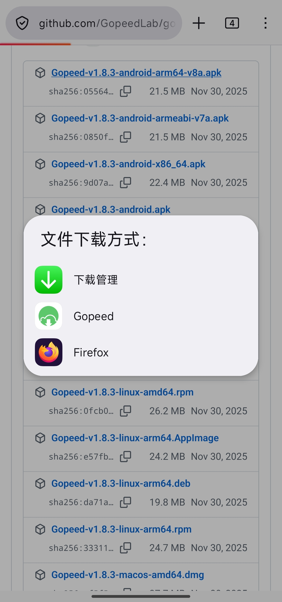

#### 自动清理任务选项 (PR #1243)

设置里可以配置任务自动清理了。开启后会自动清理文件被删除的任务，避免任务列表堆积无效任务：

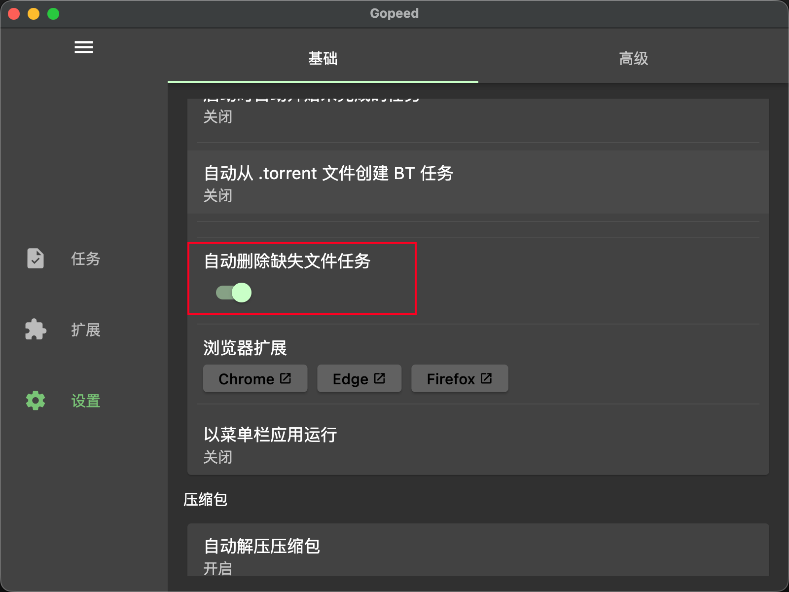

> 感谢来自社区的贡献者 `@Locon213`，这是这位小伙伴这个版本贡献的第二个 PR 了。

#### MacOS 支持以菜单栏应用运行 (PR #1216)

MacOS 上现在可以选择以菜单栏应用运行 Gopeed 了。开启后不会在 Dock 里显示图标，只出现在菜单栏：

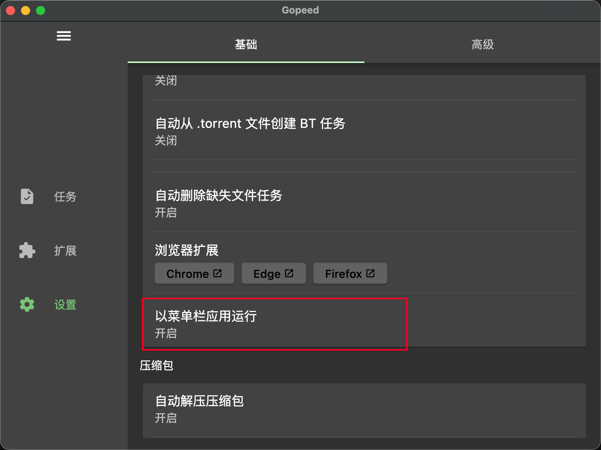

这个 PR 还加了个快捷键，MacOS 上按 <kbd>conmmand</kbd> + <kbd>w</kbd> 可以关闭主窗口，更符合 MacOS 用户的使用习惯。

> 感谢来自社区的贡献者 `@awe123343`，这个 PR review 了很多轮才合进来，也很感谢小伙伴的耐心配合。

#### 支持 Windows ARM 架构 (PR #1206)

这个版本正式支持 Windows ARM 架构了。这个 PR 挺出乎我意料的，因为 flutter 官方并没有正式支持 Windows ARM 的构建，PR 里直接指定了一个 flutter 的特殊版本来编译。这里也留了个坑，就是这个 flutter 版本不是最新的，导致我后续升级到 flutter 3.38 时遇到了依赖问题。不过最后还是解决了，感觉我是第一个吃上 flutter Windows ARM 螃蟹的人😂，连 flutter 的明星项目`LocalSend`都还没支持 Windows ARM 架构。

> 感谢来自社区的贡献者 `@Minessential`，后续可以单独写篇文章分享下 flutter Windows ARM 的构建问题。

#### 自动下载 .torrent 配置化 (PR #1219)

之前的版本会在下载`.torrent`文件后自动开启对应的 torrent 任务。收到社区用户反馈，不需要每次都自动开启，所以改成了可选项。可以在创建任务时选择是否自动从`.torrent`文件创建 torrent 任务：

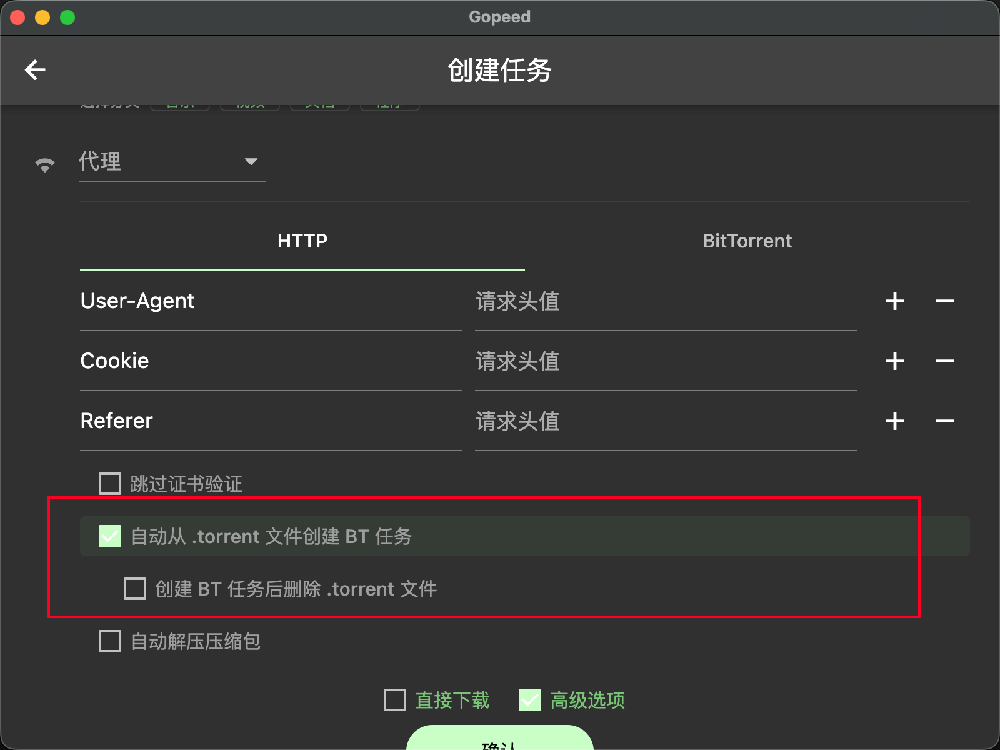

也可以在设置里配置默认行为：

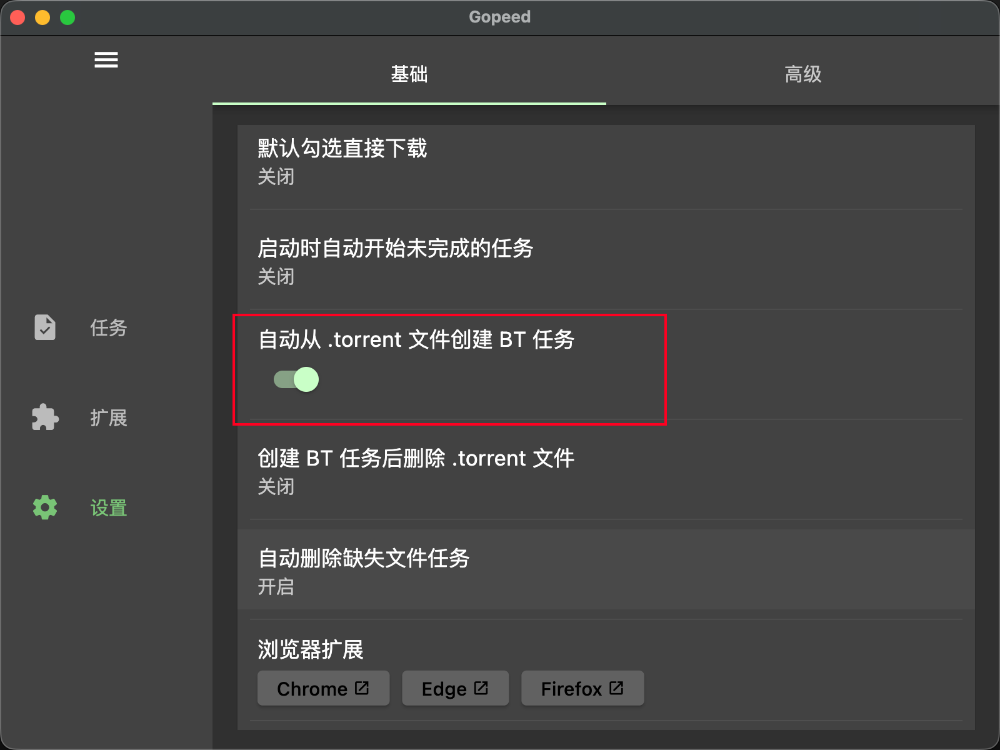

#### 应用启动时自动恢复未完成任务的功能 (PR #1203)

开启后每次启动应用都会自动恢复上次未完成的任务。可以在设置里配置，默认关闭：

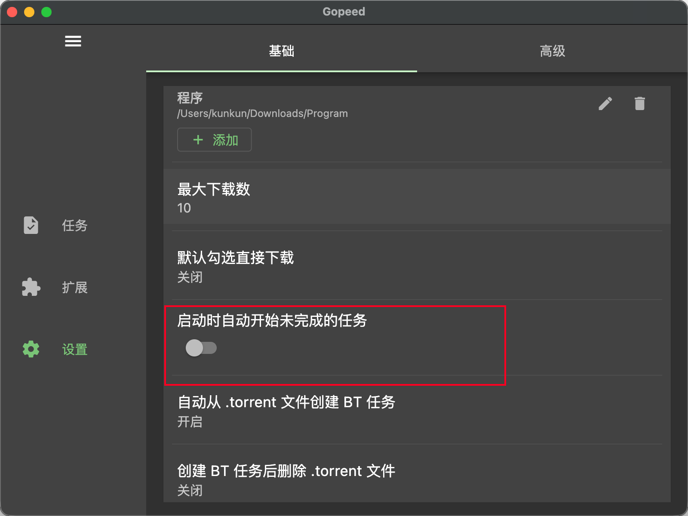

#### Web 版本地化 Google 字体资源 (PR #1241)

这也是社区用户反馈的，Web 版本打开会显示方块乱码：

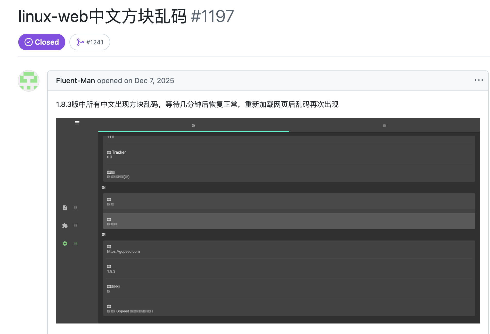

原因是 Web 版本依赖 Google Fonts 加载字体资源，在国内访问 Google Fonts 非常慢甚至打不开，导致字体加载失败显示方块。Flutter 官方没有提供解决方案，现在的做法是构建完后把`dart.main.js`里的 Google Fonts 链接预下载到本地，再替换为本地路径。这样就能避免访问 Google Fonts 了。当然字体文件体积较大，导致 Web 版本体积从之前的 20MB 变成了 40MB 左右，但也没更好的办法了。

### BUG 修复

#### 升级 goja 库以规避特殊场景下的堆栈溢出问题 (PR #1242)

这个问题之前写过一篇文章详细介绍了：[Gopeed 扩展系统 JS 引擎修复小记](/posts/gopeed-js-engine-fix)，主要是修复`油管扩展`视频无法下载的问题。

### 基础设施

前面介绍了这次大版本更新的主要内容。接下来说说这个版本里不起眼但其实很重要的基础设施改进，为后续的用户体验提升打下基础。

#### 增强 Deep Link 用以支持安装扩展 (PR #1234)

这次增强是为了能直接从浏览器一键安装扩展，比如在浏览器中打开以下链接：

```
gopeed:///extension?params=eyJ1cmwiOiJodHRwczovL2dpdGh1Yi5jb20vbW9ua2V5V2llL2dvcGVlZC1leHRlbnNpb24tYmlsaWJpbGkiLCJkZXZNb2RlIjpmYWxzZX0=
```

就能自动唤醒并安装`bilibli扩展`，不需要手动输入扩展`git`远程地址了。之后这个功能会配合官网的`扩展市场`使用，方便用户检索和安装扩展。

> 后续也会把相关的 gopeed scheme 协议文档整理出来，方便社区开发者使用。

#### 支持通过宿主 RPC 调用 Gopeed API (PR #1247)

这也是个重要的基础设施改进，直接打通了`浏览器扩展`和`Gopeed`之间的通信能力。以后浏览器扩展可以直接调用`Gopeed`的能力了，这是我某天突然想到的点子，配合`Gopeed`的扩展系统，可以实现很强大的功能。

比如安装了`油管扩展`后，用户在浏览器访问油管视频页面时，就能直接通过`RPC`调用 Gopeed 的解析能力，在浏览器上直接抓取视频进行下载，不需要再复制粘贴链接到 Gopeed 了。也能直接打通`Cookie`的传递，不需要像之前一样去浏览器开发者工具里手动复制`Cookie`了，小白用户也能轻松使用。

## 后记

这个版本收到了很多社区贡献者的 PR，也是好起来了，后续我会继续完善 Gopeed 的基础设施，比如`扩展市场`、`浏览器资源抓取`等，然后就是争取早日把新 UI 搞定，免得的一直被吐槽界面丑😂。

感谢大家的支持和反馈，我们下个版本再见！
