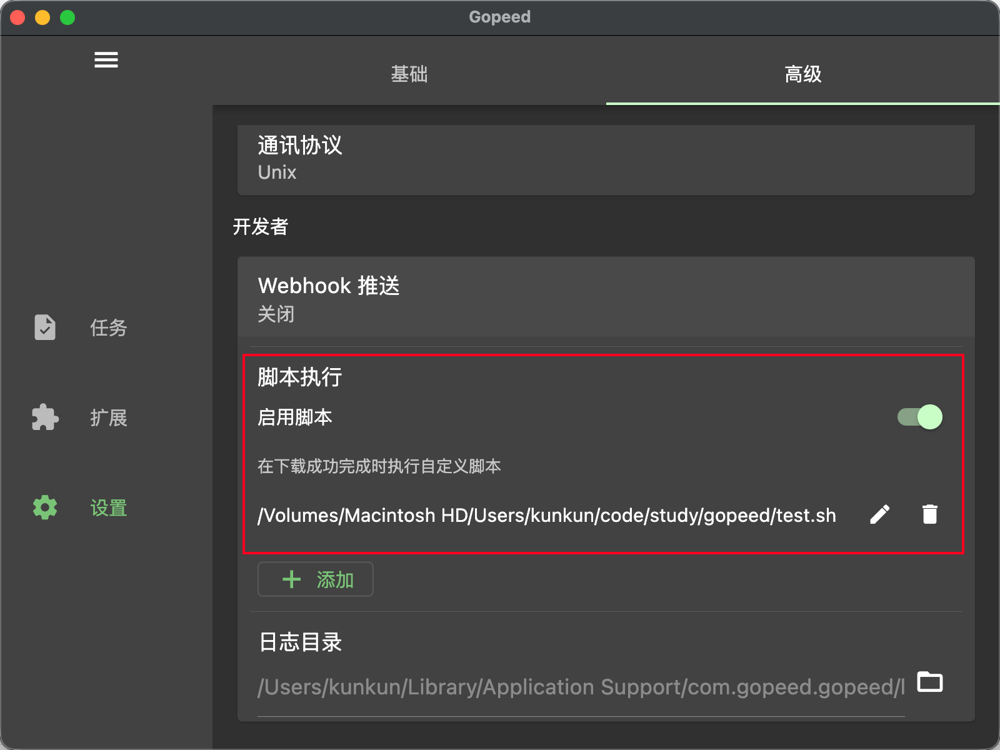
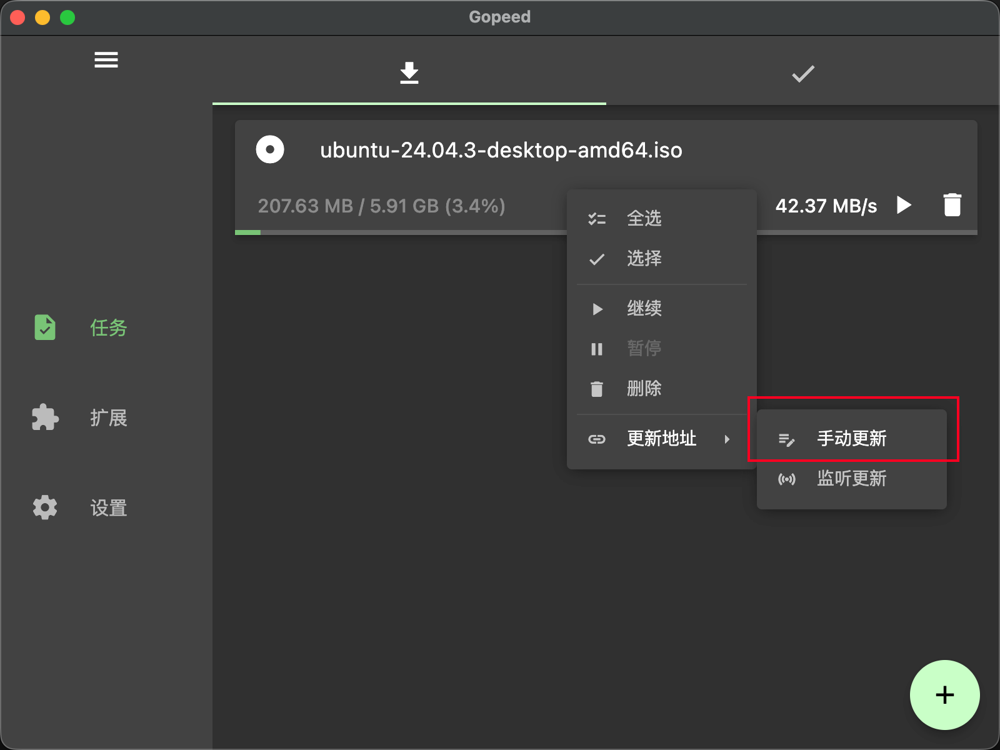
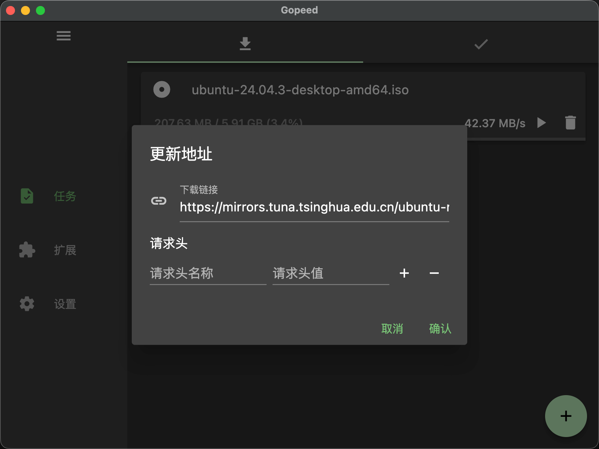
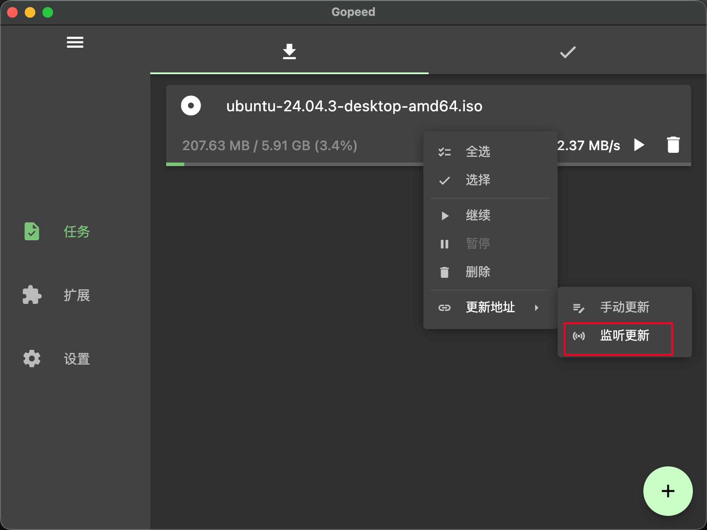
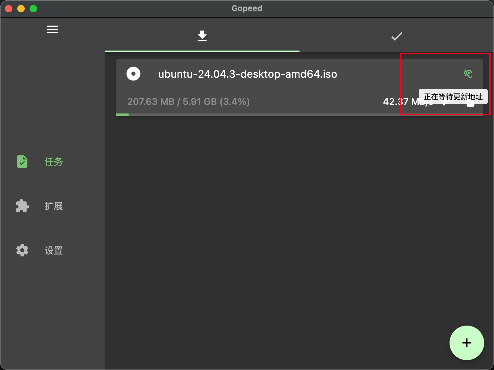
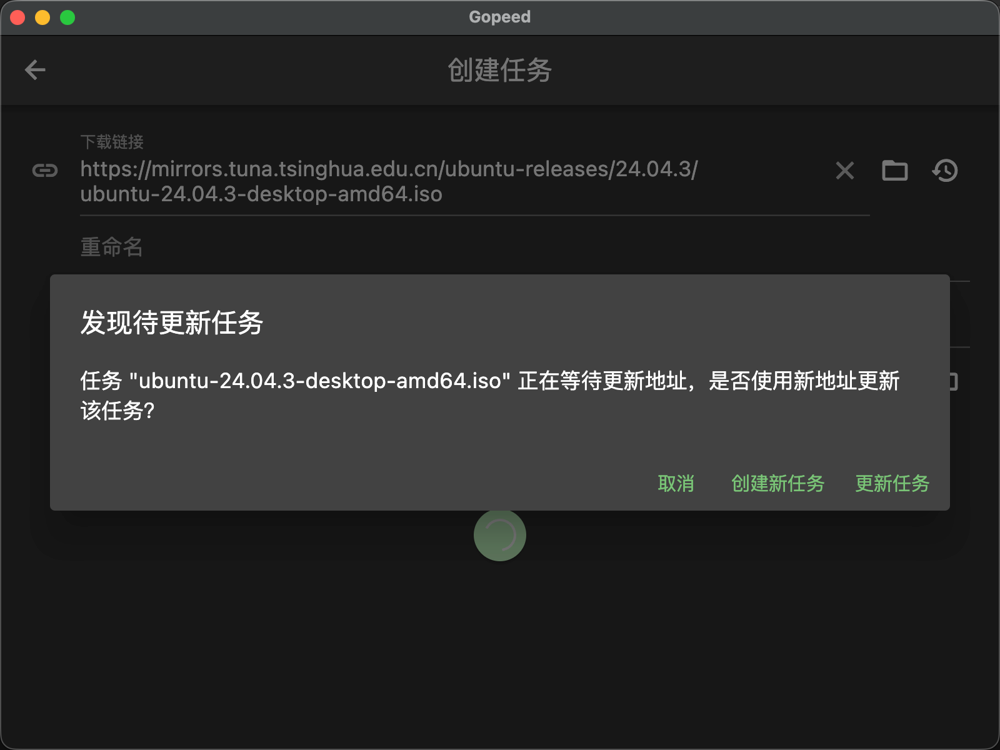

Gopeed v1.9.1 发布了！这是一个小版本更新，但是也有非常不错的新特性，下面来快速介绍一下主要更新内容。

---

## v1.9.1 主要更新

### 新特性

#### 支持任务完成后执行脚本 (PR #1265)

现在可以在任务完成后自动执行脚本了，这个功能很实用，可以在下载完成后做一些自动化操作，比如：

- 下载完成后自动通知
- 自动移动文件到特定目录
- 执行自定义的后处理脚本



可以在设置里配置脚本路径和参数，下载完成后会自动执行，脚本内置了以下几个环境变量用于访问任务信息：

| KEY                | 描述                               |
| ------------------ | ---------------------------------- |
| GOPEED_EVENT       | 事件类型，目前始终为 DOWNLOAD_DONE |
| GOPEED_TASK_ID     | 任务ID                             |
| GOPEED_TASK_NAME   | 任务名称                           |
| GOPEED_TASK_STATUS | 任务状态                           |
| GOPEED_TASK_PATH   | 下载完成的文件或文件夹的完整路径   |

比如下面一个例子用于移动下载完成的文件到指定目录：

```bash
#!/bin/bash
mv "$GOPEED_TASK_PATH" ~/Downloads/backups/
```

> 注：除了操作系统本身支持的脚本类型（比如 Windows 的 BAT、PowerShell，Linux 和 macOS 的 Shell 脚本），还支持`python`和`node`脚本，只要系统里安装了对应的运行环境就行。

#### 实现任务更新功能 (PR #1267)

这也是社区一直在提的需求，如果用过 IDM 的用户应该比较熟悉，有时候任务下载一半可能链接地址就失效了，需要用更新地址的方式继续下载，不同于 IDM 的是，Gopeed 同时支持两种方式来更新：

1. 在任务上右键选择“更新地址 -> 手动更新”，然后输入新的下载链接即可，同时也支持更新`HTTP`请求头。
   
   

2. 和 IDM 类似的监听机制，在任务上右键选择“更新地址 -> 监听更新”，标记一个任务为待更新状态，然后在创建任务的时候，如果发现有待更新的任务，就会提示是否用新的链接更新旧任务。
   
   
   

### Bug 修复

这个版本修复了不少用户反馈的问题：

#### 修复 Windows 上帧率降低的问题 (PR #1279)

有用户反馈 Windows 上界面卡顿，帧率很低。排查后发现是 Flutter 的渲染问题，这个版本已经修复了，据说 flutter 新版本已经修复了这个问题，不过还没有发 stable 版本，所以先按照社区的`workaround`先临时修复了。

#### 添加 Windows ARM64 便携版缺失的库 (PR #1273)

上个版本新增了 Windows ARM64 支持，但便携版打包时漏了一些必要的库文件导致无法正常运行，这个版本把缺失的库补上了，Windows ARM64 的小伙伴可以正常使用了。

#### ZIP 解压文件名乱码问题 (PR #1260)

有用户反馈下载的 ZIP 文件自动解压后，中文文件名会乱码。原因是 ZIP 文件里用的是 GBK 编码，而解压时没有正确处理编码转换。现在已经修复了，支持 GBK 编码的文件名了。

#### 改善 HTTP 重定向链接下载重试策略 (PR #1263)

有些下载链接会重定向到临时 URL，这种 URL 有时效性，过期后重试会失败。现在优化了重试策略，遇到重定向链接过期时，会重新请求原始 URL 获取新的重定向链接。

#### 修复 macOS 深度链接唤醒窗口问题 (PR #1262)

在 macOS 上通过深度链接唤醒 Gopeed 时，没有做好隐藏窗口的处理，这会导致如果浏览器扩展接管那边关闭了下载确认，Gopeed 冷启动的情况下也还是会弹出窗口。

### CI/CD 优化

#### Docker 镜像优化 (PR #1274)

优化了 Docker 镜像的构建流程，减小了镜像体积，提升了构建速度。

> 感谢来自社区的贡献者 `@1lkei`。

#### 升级 Windows ARM Flutter 版本 (PR #1269)

Windows ARM 的 Flutter 版本升级了，之前用的是特殊版本，现在升级到了更新的版本，解决了一些依赖问题。

## 后记

这个版本主要是修复 bug 和优化体验，感谢社区小伙伴们的反馈和贡献。下一个版本会继续完善基础功能，同时推进新 UI 的开发。

如果你在使用过程中遇到问题或者有好的想法，欢迎在公众号留言或者去 [GitHub](https://github.com/GopeedLab/gopeed) 提 issue 或者 PR。

我们下个版本再见！
