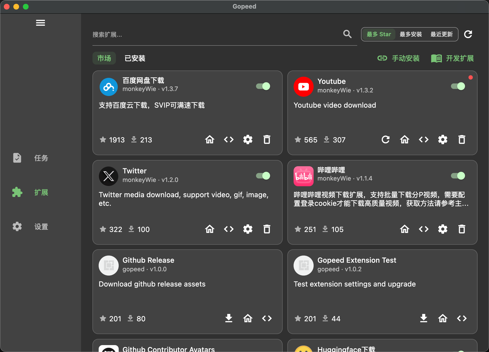
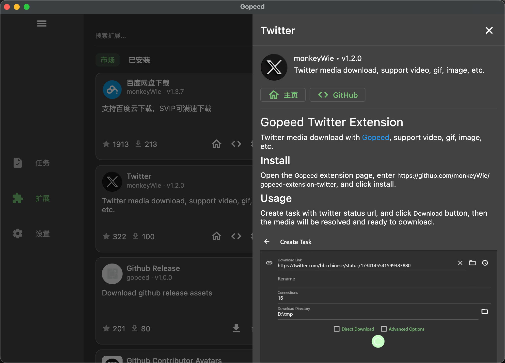
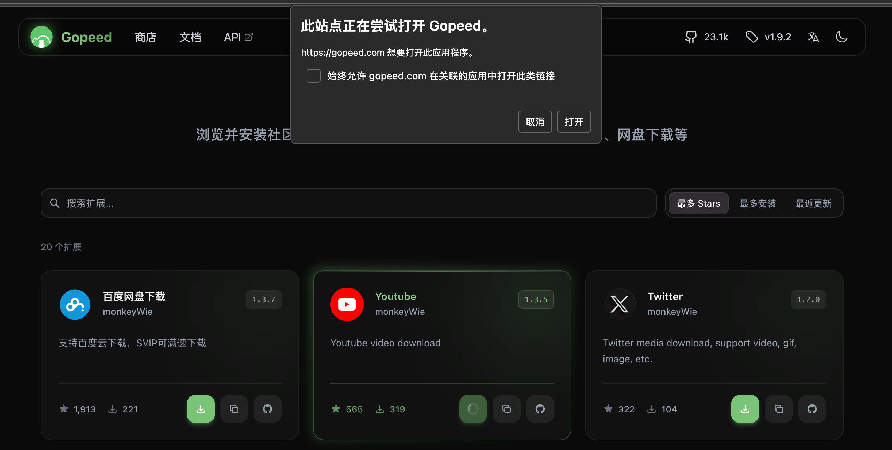
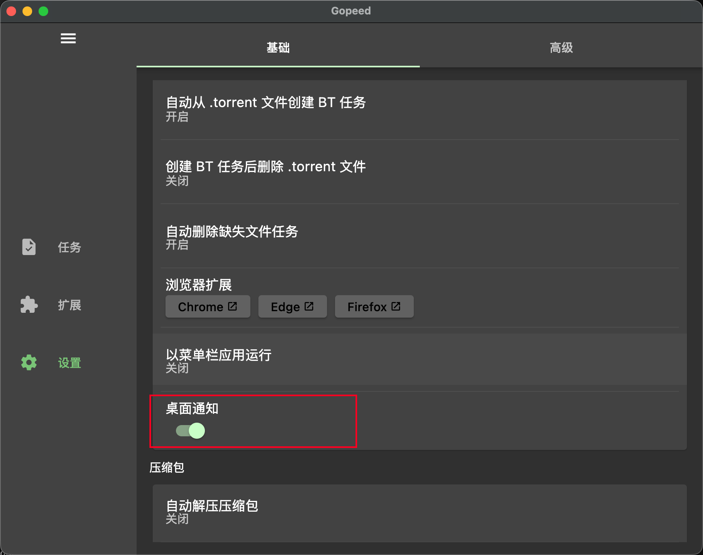

Gopeed v1.9.2 发布了！`扩展商店`重磅上线，下面来快速介绍一下主要更新内容。

---

## v1.9.2 主要更新

### 新特性

#### 扩展商店正式开放 (PR #1301)

这个功能算是前几个版本埋下的伏笔终于落地了。

在之前的版本里，已经陆续补上了安装扩展需要的基础能力，比如 Deep Link 唤醒安装、宿主 RPC 通信之类的基础设施。这次终于把这些能力串起来，做成了可直接使用的`扩展商店`。

有了扩展商店之后，安装扩展就不需要再自己去找仓库地址、复制 Git URL、手动导入了，整个体验会顺畅很多，降低扩展安装的门槛，同时也能让更多用户发现和使用到社区开发的优秀扩展了。

而且现在可以直接在应用内打开扩展详情页，省得再往浏览器里跳转。

另外还可以直接通过[官网扩展商店](https://gopeed.com/store)来安装扩展，点击安装后会自动唤起本地 Gopeed 来完成安装，整个流程非常顺畅：

#### 桌面端支持原生系统通知 (PR #1293)

这个功能是来自社区用户`@Locon213`的贡献，用于支持在任务下载完成或者发生错误时，发送系统通知，默认是开启的，可以在设置页面进行开关配置：

> 我在 macOS 上测试了一下，貌似还没有生效，后续会继续跟进这个问题。

#### Flutter 升级到 3.41.2 (PR #1290)

之前 Flutter 在 Windows 上出现了帧率降低的问题，这个版本已经修复了，所以顺势升级了上去。而且 Windows ARM 版本刚好也是 Flutter 3.41，这次就一起对齐了。

### 开发向优化

#### 浏览器调试扩展 ID 改为从环境变量读取 (PR #1281)

这个改动主要是为了优化`Gopeed 浏览器扩展`的本地开发体验，同时也顺带解决了`离线安装扩展`场景下无法正常接管下载的问题，比如这个[离线安装扩展不能触发捕获下载](https://github.com/GopeedLab/browser-extension/issues/103)。

原因在于，浏览器扩展和 Gopeed 之间要通过`Native Messaging`进行通信，而这套机制需要和指定的浏览器扩展 ID 绑定。只有 ID 匹配的扩展，才有权限和 Gopeed 建立连接并接管下载。

之前代码里写死的是我本地开发时使用的扩展 ID，这样虽然我自己调试没问题，但其他开发者如果想本地联调，或者用户通过离线方式安装了扩展，都会因为扩展 ID 不一致而无法正常通信，最终表现出来就是扩展不能接管下载。

现在改成了从环境变量中读取扩展 ID 之后，就可以根据实际安装的扩展动态配置，不需要再去改源码，本地开发调试会方便很多，离线安装扩展的接管问题也一并解决了。

> 注：如果是 macOS 系统，由于 Gopeed 是 GUI 应用，环境变量要通过 `launchctl setenv GOPEED_DEBUG_EXTENSION_IDS xxx` 来设置。

## 后记

最近几个版本基本上已经把目前计划的核心功能都补齐了，接下来会把重心放在新 UI 开发和完善文档上。中途可能还会有一些小功能和 Bug 修复的迭代，但下一次大版本更新，可能就要等到新 UI 发布了。

总之，后续会继续努力把 Gopeed 打造成一个更好用、也更好看的下载器！
