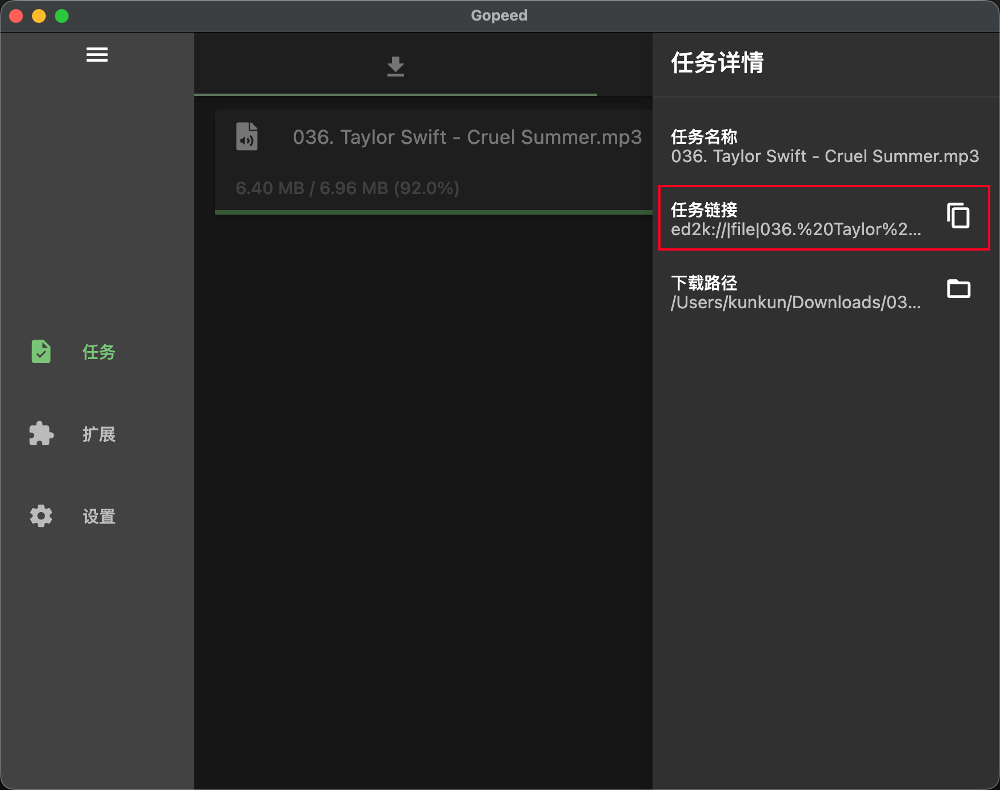

Gopeed v1.9.3 发布了！这次虽然还是一个小版本号，但是有一个重大的新特性，`ed2k` 协议到下载支持终于正式落地了。

这个需求我其实惦记很久了，只是之前一直没法下手。现在总算做出来，这让 Gopeed 一举成为市面上`唯一`同时支持`http`、`bt`和`ed2k` 协议下载的工具（傲娇脸）,下面来简单聊聊这个版本的更新。

---

## v1.9.3 主要更新

### 新特性

#### 正式支持 ed2k 协议下载 (PR #1316)

这一版最重要的特性，毫无疑问就是 `ed2k` 下载的支持。

虽然 `ed2k` 现在已经凉凉了，但它也没有真的消失。现在依然有不少冷门资源，尤其是一些老软件、系统镜像、存档资料，还只能通过这套网络获取。所以社区里这些年一直都有人在问：Gopeed 什么时候支持 `ed2k`？

问题在于，这个协议实在太老了，资料也很零散。它不像 `BitTorrent` 那样有一套相对清晰的公开规范，很多细节都只能去翻老项目源码、论坛帖子，甚至靠抓包和行为对比来确认。之前我不是没研究过，只是每次研究到一半就会发现，这活比想象中还要硬核不少。

这次总算通过 AI 把它啃下来了。现在 Gopeed 已经可以直接创建 `ed2k` 任务并接入原有的下载流程，和其他协议一样统一管理任务、查看状态、暂停继续，不需要再单独折腾老客户端。

如果你对这部分实现过程感兴趣，我前两天刚写了一篇更详细的文章：[文艺复兴！我用Go语言实现了一个ed2k下载器](/posts/go-ed2k-download)。这篇文章里把整个来龙去脉、技术取舍和实现背景都写得更完整一些。

这次 Gopeed 集成的底层实现，已经覆盖了一套可用的 `ed2k` 基础能力，包括：

- `ed2k` 文件下载
- 多任务并发下载
- 多个 `ED2K server` 并发找源
- `server.met` 加载
- `KAD` bootstrap 和 source 查找
- 资源搜索
- 暂停、继续、删除任务
- 状态持久化与恢复

对普通用户来说，最直接的变化就是：以前碰到 `ed2k` 链接，大概率还得专门装个年代感很强的老工具；现在可以直接交给 Gopeed 了。

> 当然这次只是实验性的支持，后面还会继续优化 `ed2k` 相关的体验细节。

### Bug 修复

#### 修复不支持断点续传的 HTTP 下载大小统计异常问题 (PR #1317)

有些 `HTTP` 链接本身不支持 Range 请求，这里有个边界问题，可能导致已下载字节数超过文件总大小，进而引发进度显示异常。

#### 修复等待中任务的创建状态判断逻辑 (PR #1314)

这个修复来自社区贡献者 `@Roxym3`。

主要是修正等待中任务的 `isCreate` 逻辑，这次也算上彻底解决了批量下载同名文件时，重命名的冲突问题了。

#### 修复 RPM 包图标路径 (PR #1309)

Linux `RPM` 包的图标路径做了修正，避免安装后图标显示不正常的问题。

### 文档与国际化

#### 文档链接迁移到 gopeed.com/docs (PR #1311)

之前官网改造之后，把文档站和官网合并到一个域名下了，不过readme里面一部分文档链接还指向旧的 `docs.gopeed.com`，这次统一迁移到了新的 `gopeed.com/docs` 地址。

#### 新增加泰罗尼亚语，更新土耳其语翻译 (PR #1303, #1304)

这个版本继续补充了多语言支持：

- 新增加泰罗尼亚语
- 更新土耳其语翻译

也感谢社区贡献者 `@kayron8` 和 `@Hweord`。

## 后记

本来说好的最近版本只做点小修小补，但是突然`灵感`来了在 AI 的加持下，居然把这个 `ed2k` 给做出来了，新UI的开发又暂时鸽了（想到新UI改版其实就挺头大的），后面会专注新UI的开发了，敬请期待！
