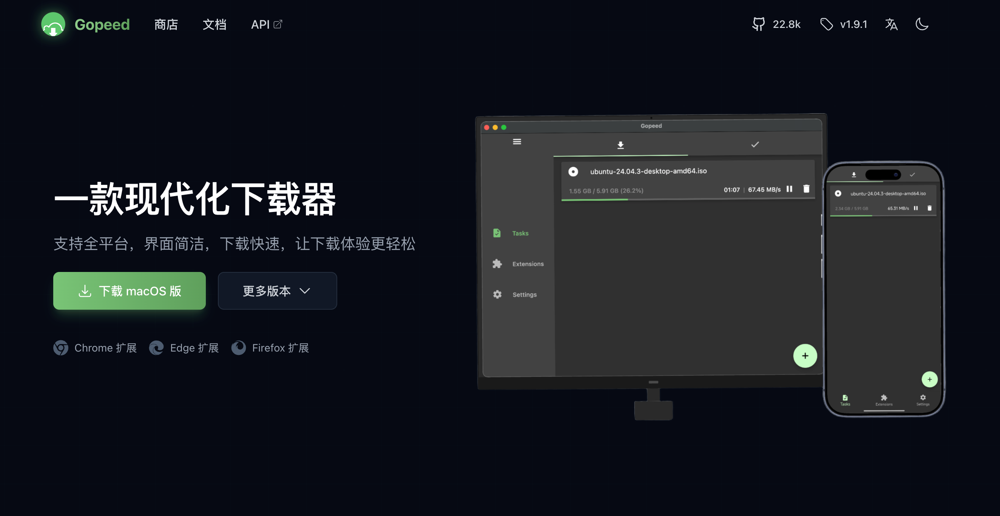
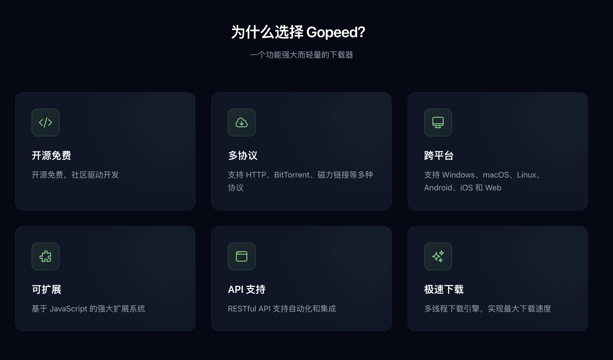
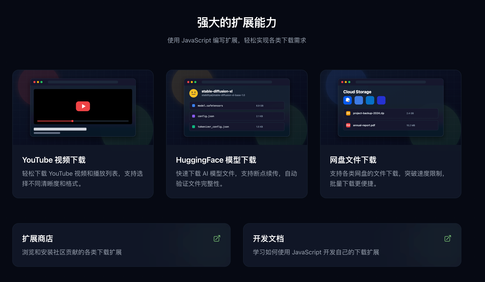
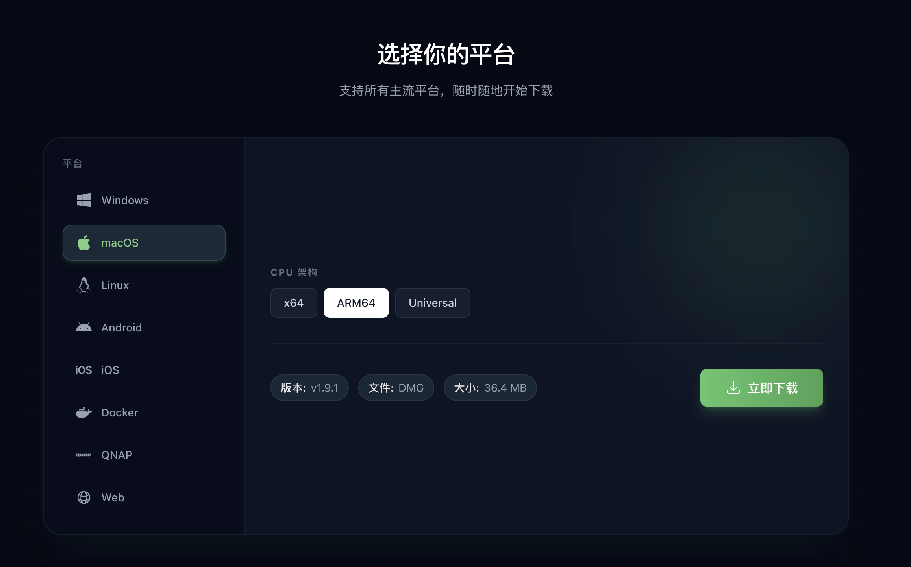
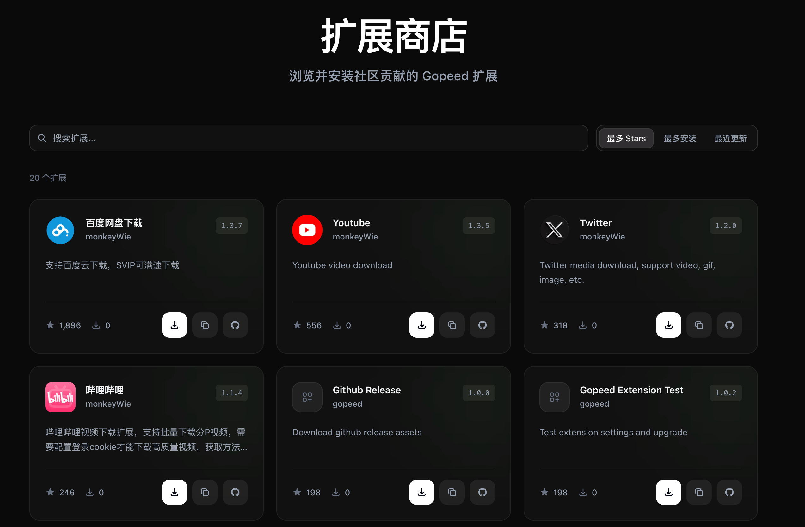
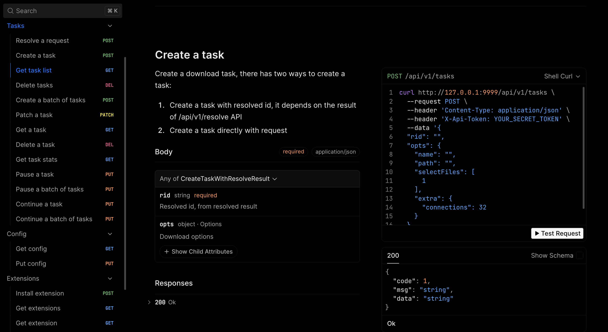

## 前言

这段时间主要都在推进 [Gopeed 官网](https://gopeed.com) 的重构，最近新版官网发布了。除了界面重做，这次也把`扩展商店`上线了，下面来详细介绍一下这次改版的主要内容，先放个预览图：

## 官网内容补充

老官网基本只有一个展示页，特性介绍和下载页都没有，整体就是 `能用就行`。这次主要补了这几个板块：

**特性介绍**：把 Gopeed 的核心能力系统化展示出来。

**扩展展示**：展示热门扩展，并提供扩展商店和开发文档入口。

**下载中心**：独立下载组件，支持按平台和版本选择。

旧版下载按钮会根据 `浏览器 UA` 自动识别并直接下载对应版本。但只要用户想下其他平台，就得自己去 GitHub Releases 里翻，对不熟悉 GitHub 的用户不太友好。

新版下载页加了平台选择组件：默认按 `浏览器 UA` 选中推荐版本，也可以手动切换平台和版本。考虑到国内访问 GitHub 的稳定性问题，下载链接也接入了镜像，下载时会自动测速并优先选择最快节点。

## 开放扩展商店

### 背景

Gopeed 的扩展系统其实做了挺久，但几个痛点一直存在：用户不知道去哪找扩展，安装要手动填 GitHub 链接，开发者也缺稳定曝光入口。所以这次直接把扩展商店做出来，集中展示、集中安装。

### 自动爬取

扩展商店的数据完全自动化：定期爬取 GitHub 上带 `gopeed-extension` 标签的项目，再把扩展信息同步到 Cloudflare D1 数据库。

这样扩展仓库只要打上标签，就能被商店爬虫自动发现，不需要额外提审，整体还是去中心化分发。

### 浏览和安装

商店页面支持按名称和热度搜索。安装流程得益于 `1.9.0` 引入的 **Gopeed Scheme**：点 `安装` 就会直接唤起本地 Gopeed 完成安装，扩展安装链路终于闭环了。

### App 内扩展页

同样地，下个版本里 Gopeed 应用内的扩展页也会直接接商店接口。这样用户不用再去 GitHub 到处翻，在应用里就能直接浏览和安装。

## 官网和文档站点统一

### 之前的问题

改版之前，Gopeed 的官网和文档站是两个独立的站点：

- 官网：[gopeed.com](https://gopeed.com)
- 文档站：[docs.gopeed.com](https://docs.gopeed.com)

这种拆分的问题其实一直很明显：

- SEO 不友好：官网和文档分离，权重被分散。
- 维护成本高：两套代码库都要维护，开发和运维都更重。
- 体验割裂：用户要在不同域名之间来回跳，视觉和交互也不统一。

### 改进方案

这次把官网和文档统一到同一套基于 **Next.js** 的框架：**[fumadocs](https://fumadocs.vercel.app/)**。

选 fumadocs 的原因很务实：UI 足够好、开箱即用，MDX、搜索、API 文档这些能力都省得自己再造轮子。再配合 Next.js 的 ISR，SEO 也能稳住。

合并之后，官网和文档都放在 `gopeed.com` 下。`docs.gopeed.com` 正式退休，文档入口统一为 `gopeed.com/docs`。

> 现在访问 `docs.gopeed.com` 会永久重定向到 `gopeed.com/docs`。先把历史收录链接兜住，等搜索引擎索引更新后，再把旧站彻底下线。

## OpenAPI 文档迁移到 Scalar

Cloudflare Workers 有 3MB 的代码体积限制。Fumadocs 虽然自带 OpenAPI 组件，但打包后会让项目直接超限。要继续用它，就得回到 Vercel，那前面的迁移就白做了。

所以改用了 **[Scalar](https://scalar.com/)**。它体积更小，UI 也更清爽，还支持在文档里直接调试 API。实际用下来没有明显功能缺口，是个省心的替代方案。

## 迁移到 Cloudflare Workers

之前官网和文档站都部署在 Vercel。Vercel 的免费额度对小项目没问题，但 Gopeed 官网流量不算小，时不时会用完免费额度，访问会受影响。升级付费方案当然能解决，但对开源项目来说，长期成本还是得算。

所以这次迁移到了 **Cloudflare Workers**，并且把扩展商店的数据放到 **D1 数据库**，主打一个白嫖。

## 后记

这次改版前后折腾了差不多两个月，核心目标基本都落地了：站点结构统一、下载体验完整、扩展生态也有了稳定入口，阶段性的重构先告一段落，接下来就是按这个方向继续把细节打磨好。

刚好今天是元宵节，也祝各位元宵节快乐。
