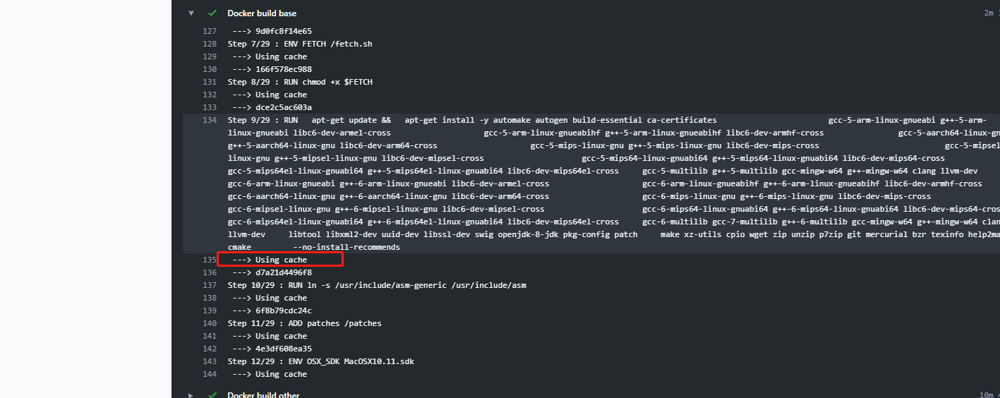

## 介绍

[Github Actions](https://github.com/features/actions)是 github 官方推出的一款 CI(持续集成)工具，目前还处于`Beta`版本，需要[申请](https://github.com/features/actions/signup/)内测资格才能使用，申请成功之后在自己的代码仓库就可以看到`Actions`了。


<!-- more -->

## 使用说明

这里简单介绍下 `Github Actions`中的概念，具体可以参考[官方文档](https://help.github.com/en/github/automating-your-workflow-with-github-actions)。

### 术语

1. **workflow**
   表示一次持续集成的过程
2. **job**
   表示构建任务，每个 workflow 可以由一个或者多个 job 组成，可支持并发执行 job，所有 job 执行完也就代表着 workflow 结束
3. **step**
   每个 job 由一个或多个 step 组成，按顺序依次执行
4. **action**
   每个 step 由一个或多个 action 组成，按顺序依次执行，这里 action 需要特别说明一下，action 是可以是自定义脚本或引用第三方的脚本，依赖着 github 开源社区，许多 action 都可以直接复用，无需自己编写，github 已经提供了一个[action 市场](https://github.com/marketplace?type=actions)，可以搜索到各种第三方 actions，并且[官方](https://github.com/actions)也提供了许多 actions。

### 构建环境

每个 job 都可以指定对应的操作系统，支持`Windows、Linux、macOS`，github 会提供一个虚拟机来执行对应的 job。

硬件规格：

- 双核 CPU
- 7GB 内存
- 14GB 固态硬盘

使用限制：

- 每个仓库只能同时支持 20 个 workflow 并行
- 每小时可以调用 1000 次 github API
- 每个 job 最多可以执行 6 个小时
- 免费版的用户最大支持 20 个 job 并发执行，macOS 系统的话最大只支持 5 个

可以看到这个配置下，普通的项目持续集成肯定没什么问题的。

### 构建记录

通过仓库中的`Actions`选项卡，可以看到项目中的 workflow 构建记录：


点击一条记录可以进入详情页面，可以`实时`查看每一个`action`的控制台输出，方便调试：


## 实例

前面大概介绍了一下基本的概念，下面就直接通过几个实例看看 `Github Actions`是如何使用的。

### 自动部署 Hexo 博客到 Github Page

首先第一个想到能用到`Github Actions`的就是我的博客了，项目托管在[https://github.com/monkeyWie/monkeywie.github.io](https://github.com/monkeyWie/monkeywie.github.io)，目前项目有两个分支，`master`分支用于存放 hexo 编译之后的静态文件，另一个`hexo`分支用于存放 hexo 项目环境和 markdown 文章，`master`分支通过`Github Page`配置之后可以通过`monkeywie.github.io`域名访问。


之前写完博客之后都是需要手动执行一遍命令进行部署：

```sh
hexo clean&&hexo d
```

然后再把`hexo`分支代码推送到 github 上

```sh
git push
```

在使用`Github Actions`之后，只需要把`hexo`分支代码推送到 github 上，剩下的全部交给`Github Actions`即可，在此之前我们需要生成一对`公私钥`用于 hexo 的部署操作，因为 hexo 自带的部署命令`hexo d`需要有 git 远程仓库读写权限。

```sh
ssh-keygen
Generating public/private rsa key pair.
Enter file in which to save the key (/root/.ssh/id_rsa):
Created directory '/root/.ssh'.
Enter passphrase (empty for no passphrase):
Enter same passphrase again:
Your identification has been saved in /root/.ssh/id_rsa.
Your public key has been saved in /root/.ssh/id_rsa.pub.
The key fingerprint is:
SHA256:XG1vkchp5b27tteZASx6ZrPRtTayGYmacRdjjRxR1Y0 root@8fe85d51123b
The key's randomart image is:
+---[RSA 2048]----+
|             .+o=|
|           o *Eoo|
|          . X B .|
|       . . + X +.|
|        S . = O..|
|         o O B =.|
|          O = *.*|
|         o . o ++|
|              .oo|
+----[SHA256]-----+
```

先把`~/.ssh/id_rsa.pub`中的公钥添加到 Github 对应仓库的`Deploye keys`中：


再将`~/.ssh/id_rsa`中的私钥添加到 Github 对应仓库的`Secrets`中，Name 定义为`ACTION_DEPLOY_KEY`，目的是在构建的时候可以读取该私钥并配添加到虚拟机中，以获取 git 仓库访问权限：


准备工作完成后，接着就按照[教程](https://help.github.com/en/github/automating-your-workflow-with-github-actions/configuring-a-workflow#creating-a-workflow-file)，在`hexo`分支创建`.github/workflows/main.yaml`文件用于配置 hexo 部署。

```yaml
name: CI

on:
  push:
    branches:
      - hexo
jobs:
  build:
    runs-on: ubuntu-latest

    steps:
      - name: Checkout source
        uses: actions/checkout@v1
        with:
          ref: hexo
      - name: Use Node.js ${{ matrix.node_version }}
        uses: actions/setup-node@v1
        with:
          version: ${{ matrix.node_version }}
      - name: Setup hexo
        env:
          ACTION_DEPLOY_KEY: ${{ secrets.ACTION_DEPLOY_KEY }}
        run: |
          mkdir -p ~/.ssh/
          echo "$ACTION_DEPLOY_KEY" > ~/.ssh/id_rsa
          chmod 600 ~/.ssh/id_rsa
          ssh-keyscan github.com >> ~/.ssh/known_hosts
          git config --global user.email "liwei2633@163.com"
          git config --global user.name "monkeyWie"
          npm install hexo-cli -g
          npm install
      - name: Hexo deploy
        run: |
          hexo clean
          hexo d
```

具体的配置语法这里就不详细说明了，可以自行在官方文档中查阅。

构建流程如下：

1. 监听`hexo`分支的 push 操作
2. 运行一个 job，在`ubuntu`虚拟机环境下
3. 使用官方提供的[actions/checkout@v1](https://github.com/actions/checkout)来拉取源码
4. 使用官方提供的[actions/setup-node@v1](https://github.com/actions/setup-node)来安装 node 环境
5. 使用 `${{ secrets.ACTION_DEPLOY_KEY }}`读取刚刚生成的私钥，并设置成环境变量，`${{ exp }}`写法为 actions 内置的表达式语法，详细文档参考：[contexts-and-expression-syntax-for-github-actions](https://help.github.com/en/github/automating-your-workflow-with-github-actions/contexts-and-expression-syntax-for-github-actions)
6. 将私钥写入到`~/.ssh/id_rsa`文件中，并把`github.com`域名加入到`~/.ssh/known_hosts`文件中，以免第一次 ssh 访问时弹出交互式命令。
7. 配置 git 用户信息
8. 安装 hexo 命令行工具和项目的依赖
9. 调用 hexo 命令进行部署

把`hexo`分支代码推到 github 上触发 workflow ，通过`Actions`选项卡进入就可以看到项目的构建情况了。


至此改造完成，以后只需要写完文章直接提交代码就可以自动部署了，甚至都可以不装 node 环境进行写作简直不要太方便。

### 自动创建项目 Release

有些项目在发布新版本时，一般都会创建一个`Github Release`，并且把对应编译好之后的文件上传到`Release`的资源列表中，例如：


如果这个使用手动操作的话，不仅步骤重复又繁琐(每次都要编译出各个操作系统对应的发行包再进行上传)，而且最蛋疼的是对于国内的网络环境来说，上传文件速度简直不能忍，好不容易上传了一大半搞不好就因为网络原因又要重新上传，相信用过的人都深有体会。

我就在想如果能用`Github Actions`来创建`Release`,并且做对应的编译和上传，那上面的问题都可以迎刃而解了，于是在官方市场搜索了一下`Release`关键字，果然已经有提供对应的`actions`了：

- [create-release](https://github.com/actions/create-release): 用于创建 release
- [upload-release-asset](https://github.com/actions/upload-release-asset): 用于上传资源到对应的 release 中

接着创建一个`Github仓库`，我测试的仓库地址是[https://github.com/monkeyWie/github-actions-demo](https://github.com/monkeyWie/github-actions-demo)，项目用 go 语言写的，代码非常简单就是两个 hello world 级别的代码，里面包含了普通的 go 程序和 cgo 程序。

项目的构建流程是在项目`git push --tags`的时候，触发 workflow，通过`Github Actions`编译出来`Windows、Linux、macOS`三个操作系统对应的 64 位可执行文件，再根据`tag name`和`tag message`来创建对应的`Github Release`，并将编译好的文件上传。

同样的创建一个`.github/workflows/main.yml`文件，内容如下：

```yaml
name: CI

on:
  push:
    # Sequence of patterns matched against refs/tags
    tags:
      - "v*" # Push events to matching v*, i.e. v1.0, v20.15.10
jobs:
  build:
    runs-on: ubuntu-latest

    steps:
      - name: Checkout source
        uses: actions/checkout@v1
      - name: Use Golang
        uses: actions/setup-go@v1
        with:
          go-version: "1.13.x"
      - name: Build normal
        run: |
          CGO_ENABLED=0 GOOS=windows GOARCH=amd64 go build -o normal-windows-x64.exe cmd/normal/main.go
          CGO_ENABLED=0 GOOS=linux GOARCH=amd64 go build -o normal-linux-x64 cmd/normal/main.go
          CGO_ENABLED=0 GOOS=darwin GOARCH=amd64 go build -o normal-darwin-x64 cmd/normal/main.go
          zip normal-windows-x64.zip normal-windows-x64.exe
          zip normal-linux-x64.zip normal-linux-x64
          zip normal-darwin-x64.zip normal-darwin-x64
      - name: Build cgo
        run: |
          go get github.com/monkeyWie/xgo
          ~/go/bin/xgo -targets=windows/amd64,linux/amd64,darwin/amd64 -ldflags="-w -s" -pkg=cmd/cgo/main.go -out=cgo .
          mv cgo-windows-* cgo-windows-x64.exe
          mv cgo-linux-* cgo-linux-x64
          mv cgo-darwin-* cgo-darwin-x64
          zip cgo-windows-x64.zip cgo-windows-x64.exe
          zip cgo-linux-x64.zip cgo-linux-x64
          zip cgo-darwin-x64.zip cgo-darwin-x64
      - name: Create Release
        id: create_release
        uses: monkeyWie/create-release@master
        env:
          GITHUB_TOKEN: ${{ secrets.GITHUB_TOKEN }}
        with:
          tag_name: ${{ github.ref }}
          release_name: Release ${{ github.ref }}
          draft: false
          prerelease: false

      - name: Upload Release normal windows
        uses: actions/upload-release-asset@v1.0.1
        env:
          GITHUB_TOKEN: ${{ secrets.GITHUB_TOKEN }}
        with:
          upload_url: ${{ steps.create_release.outputs.upload_url }} # This pulls from the CREATE RELEASE step above, referencing it's ID to get its outputs object, which include a `upload_url`. See this blog post for more info: https://jasonet.co/posts/new-features-of-github-actions/#passing-data-to-future-steps
          asset_path: ./normal-windows-x64.zip
          asset_name: normal-${{ steps.create_release.outputs.tag }}-windows-x64.zip
          asset_content_type: application/zip
      - name: Upload Release normal linux
        uses: actions/upload-release-asset@v1.0.1
        env:
          GITHUB_TOKEN: ${{ secrets.GITHUB_TOKEN }}
        with:
          upload_url: ${{ steps.create_release.outputs.upload_url }} # This pulls from the CREATE RELEASE step above, referencing it's ID to get its outputs object, which include a `upload_url`. See this blog post for more info: https://jasonet.co/posts/new-features-of-github-actions/#passing-data-to-future-steps
          asset_path: ./normal-linux-x64.zip
          asset_name: normal-${{ steps.create_release.outputs.tag }}-linux-x64.zip
          asset_content_type: application/zip
      - name: Upload Release normal darwin
        uses: actions/upload-release-asset@v1.0.1
        env:
          GITHUB_TOKEN: ${{ secrets.GITHUB_TOKEN }}
        with:
          upload_url: ${{ steps.create_release.outputs.upload_url }} # This pulls from the CREATE RELEASE step above, referencing it's ID to get its outputs object, which include a `upload_url`. See this blog post for more info: https://jasonet.co/posts/new-features-of-github-actions/#passing-data-to-future-steps
          asset_path: ./normal-darwin-x64.zip
          asset_name: normal-${{ steps.create_release.outputs.tag }}-darwin-x64.zip
          asset_content_type: application/zip

      - name: Upload Release cgo windows
        uses: actions/upload-release-asset@v1.0.1
        env:
          GITHUB_TOKEN: ${{ secrets.GITHUB_TOKEN }}
        with:
          upload_url: ${{ steps.create_release.outputs.upload_url }} # This pulls from the CREATE RELEASE step above, referencing it's ID to get its outputs object, which include a `upload_url`. See this blog post for more info: https://jasonet.co/posts/new-features-of-github-actions/#passing-data-to-future-steps
          asset_path: ./cgo-windows-x64.zip
          asset_name: cgo-${{ steps.create_release.outputs.tag }}-windows-x64.zip
          asset_content_type: application/zip
      - name: Upload Release cgo linux
        uses: actions/upload-release-asset@v1.0.1
        env:
          GITHUB_TOKEN: ${{ secrets.GITHUB_TOKEN }}
        with:
          upload_url: ${{ steps.create_release.outputs.upload_url }} # This pulls from the CREATE RELEASE step above, referencing it's ID to get its outputs object, which include a `upload_url`. See this blog post for more info: https://jasonet.co/posts/new-features-of-github-actions/#passing-data-to-future-steps
          asset_path: ./cgo-linux-x64.zip
          asset_name: cgo-${{ steps.create_release.outputs.tag }}-linux-x64.zip
          asset_content_type: application/zip
      - name: Upload Release cgo darwin
        uses: actions/upload-release-asset@v1.0.1
        env:
          GITHUB_TOKEN: ${{ secrets.GITHUB_TOKEN }}
        with:
          upload_url: ${{ steps.create_release.outputs.upload_url }} # This pulls from the CREATE RELEASE step above, referencing it's ID to get its outputs object, which include a `upload_url`. See this blog post for more info: https://jasonet.co/posts/new-features-of-github-actions/#passing-data-to-future-steps
          asset_path: ./cgo-darwin-x64.zip
          asset_name: cgo-${{ steps.create_release.outputs.tag }}-darwin-x64.zip
          asset_content_type: application/zip
```

构建流程如下：

1. 监听 tag name 为`v`开头的 push
2. 运行一个 job，在`ubuntu`虚拟机环境下
3. 拉取源码，安装`golang 1.13.x`环境
4. 使用`go build`交叉编译出不同操作系统下 64 位可执行文件，并使用 zip 压缩
5. 使用`xgo`交叉编译出不同操作系统下 64 位可执行文件，并使用 zip 压缩
6. 使用`monkeyWie/create-release@master`创建 Release，其中会用到`${{ secrets.GITHUB_TOKEN }}`，这是`Github Actions`内置的一个[秘钥](https://help.github.com/en/github/automating-your-workflow-with-github-actions/virtual-environments-for-github-actions#github_token-secret)，用于授权访问你自己的 github 存储库，原理就是使用这个`TOKEN`调用`Github API`来进行创建 release，还有一个`${{ github.ref }}`也是`Github Actions`内置的一个[变量](https://help.github.com/en/github/automating-your-workflow-with-github-actions/contexts-and-expression-syntax-for-github-actions#github-context)，然后通过 action 的`with`进行参数传递。
7. 使用`actions/upload-release-asset@v1.0.1`上传文件，这里使用了两个表达式`${{ steps.create_release.outputs.upload_url }}`和`${{ steps.create_release.outputs.tag }}`，可以获取到指定`action`的输出，第一个是获取创建好的 release 对应的上传地址，第二个是获取对应的 tag(例如：v1.0.0)，这样就可以在把上传的文件带上版本号。因为这个`action`不支持多个文件上传，所以就写了多个 action 进行上传。

接下来在项目打个`tag`，然后`push`上去看看效果：

```sh
# 创建tag名为v1.0.8，并添加描述
git tag -a "v1.0.8" -m '发布v1.0.8版本
修复了以下bug:
1. xxxxx
2. xxxxx'
# 把tag推到github上
git push --tags
```

然后就可以看到已经有一个新的`workflow`正在运行了：


运行完成后在`Releases`页面查看结果：


完美！和预想的结果一致。

> 注：由于官方的[create-release](https://github.com/actions/create-release)有点不能满足需求，于是我自己`fork`了一份[create-release](https://github.com/monkeyWie/create-release)代码，就是把`tag name`给输出来了，这里是相关的[PR](https://github.com/actions/create-release/pull/10)，还没被合并，所以上面的创建 Release 的 action 是用的我自己的仓库`monkeyWie/create-release@master`，还有关于 go 交叉编译的知识，有兴趣可以看看我的这篇博客：[go-cross-compile](https://monkeywie.github.io/2019/10/10/go-cross-compile)。

### 自动构建和部署 docker 镜像

在`Github Actions`提供的虚拟机中，已经内置了`docker`，而刚好我有一个项目因为国内的网络原因构建`docker镜像`非常的慢，这是我`fork`的一个用于 go 项目交叉编译的项目，仓库地址[https://github.com/monkeyWie/xgo](https://github.com/monkeyWie/xgo)，这个项目的主要工作原理就是通过 docker 里内置好各种`交叉编译`的工具链，然后对外提供 go 项目交叉编译功能，下面节选一点`Dockerfile`内容：


看这大量的`apt-get install`，就知道在本地构建有多慢了，下面就改用`Github Actions`来帮忙构建和部署镜像。

由于要将镜像推送到`docker hub`官方镜像仓库上，需要验证账号信息，
这里我把自己的用户密码配置到了`Secrets`中，以便在 workflow 配置文件中可以访问到：


编写构建文件`.github/workflows/main.yml`：

```yaml
name: CI

on:
  push:
    branches:
      - master
    paths:
      - "docker/base/*"

jobs:
  build:
    runs-on: ubuntu-latest

    steps:
      - name: Checkout source
        uses: actions/checkout@v1
      - name: Docker login
        run: docker login -u liwei2633 -p ${{ secrets.DOCKER_HUB_PWD }}
      - name: Docker build base
        run: |
          docker pull liwei2633/xgo:base
          docker build --cache-from=liwei2633/xgo:base -t liwei2633/xgo:base ./docker/base
          docker push liwei2633/xgo:base
      - name: Docker build other
        run: |
          docker build -t liwei2633/xgo:go-1.12.10 ./docker/go-1.12.10
          docker push liwei2633/xgo:go-1.12.10
          docker build -t liwei2633/xgo:go-1.12.x ./docker/go-1.12.x
          docker push liwei2633/xgo:go-1.12.x
          docker build -t liwei2633/xgo:go-1.13.1 ./docker/go-1.13.1
          docker push liwei2633/xgo:go-1.13.1
          docker build -t liwei2633/xgo:go-1.13.x ./docker/go-1.13.x
          docker push liwei2633/xgo:go-1.13.x
          docker build -t liwei2633/xgo:go-latest ./docker/go-latest
          docker push liwei2633/xgo:go-latest
```

构建流程如下：

1. 监听 master 分支的 push 操作，并且`docker/base`目录下文件有修改才进行构建，这样做的目的是在其它与 docker 构建无关的文件改动了不会去触发 workflow
2. 运行一个 job，在`ubuntu`虚拟机环境下
3. 拉取源码
4. 登录 docker hub，通过之前配置的`${{ secrets.DOCKER_HUB_PWD }}`，这里不用担心控制台输出会暴露密码，通过`secrets`访问的变量在控制台输出时都会打上马赛克
   
5. 构建镜像，这里使用了一个小技巧`--cache-from=liwei2633/xgo:base`，预先下载好之前的镜像`liwei2633/xgo:base`，然后可以使用`docker`的缓存机制加快构建速度
   
6. 推送镜像并编译和推送不同 go 版本的镜像

这样通过`Github Actions`就把构建镜像和部署时间的缩小了到了`13分钟`：


虽然还是挺慢的但是跟本地构建比起来快了不是一个量级，有次本地构建等了一个多小时，因为网络原因导致一个软件源安装失败直接没了又要重头开始构建，所以高下立判，`Github Actions`真香！！

## 后记

通过上面三个实例项目，可以看得出`Github Actions`为我们节省大量的时间和重复的操作，且通过官方的 actions 市场很方便的就可以实现大部分编排功能，真是一个可以吹爆的良心产品，所以赶紧一起来尝鲜啊。
