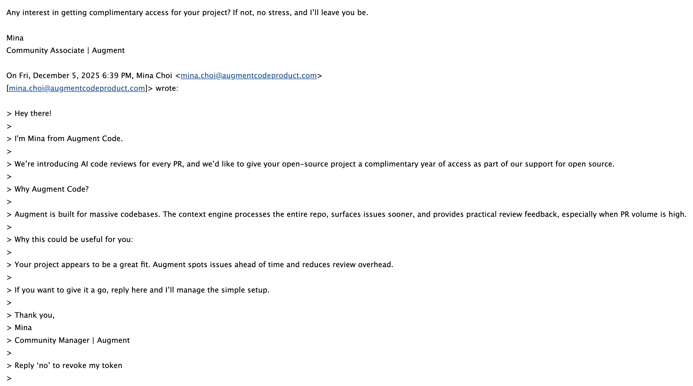
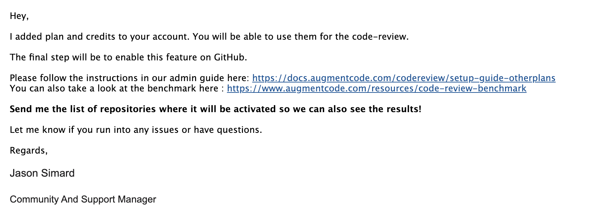
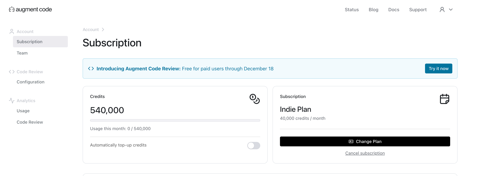
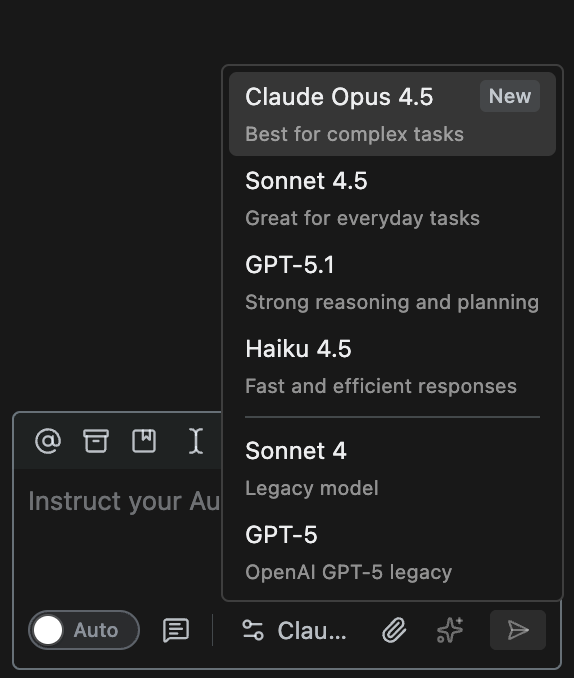

事情是这样的：最近我收到一封来自 Augment Code 官方的邮件，说他们在做一个面向开源项目的推广活动——给参与者免费赞助一年订阅服务。

我抱着“试试看，反正不亏”的心态回了邮件表达兴趣，结果真的收到了确认邮件。

登录到 Augment Code 一看，好家伙，账号里直接多了一大把 `Credits`。

## Augment Code 简介

Augment Code 和 GitHub Copilot 差不多，都是做 AI 编程助手：它不做自己的 IDE，而是以插件的方式接入现有编辑器，主打在大仓库里用更强的上下文理解来辅助开发（Chat、补全、Agent、CLI 等）。背景方面，他们在 2024 年 4 月对外宣布完成 2.27 亿美元的 B 轮融资（投后估值 9.77 亿美元）。至于这次面向开源项目的合作，我更倾向理解为：他们想把产品放到真实仓库里跑一跑。

Augment Code支持的模型也挺多的，包括 OpenAI 的 GPT-5.1、Anthropic 的 Claude Opus 4.5 等顶级模型，

## 免费赞助也不是白拿

当然，赞助不是“无条件白给”。我从邮件沟通里理解到，这个开源赞助计划的重点，是希望参与者把它用在真实的协作流程里，尤其是它的 GitHub PR Review（Augment Code Review）能力。

他们对 Code Review 的定位也很明确：不是在 PR 里刷一堆“改个命名/加个注释”的噪音，而是更关注 correctness、架构/跨文件影响、潜在风险、缺测试等更可能影响合并决策的问题，并且可以直接在 GitHub 的 PR 里以内联评论的形式给到反馈。

换句话说：你拿到免费额度，最好别只拿来“写写 demo”，而是要把它用在 review 上，真的让它参与到你项目的质量把关里。

## AI 左右互搏

我平常写代码基本上离不开 `GitHub Copilot`，既然现在 Augment 给了我一年的订阅，那正好来一波“AI 左右互搏”：让 Copilot 负责写，让 Augment 负责审。

我拿自己的开源项目 `Typix` 先热热身，刚好手头有个小 bug 要修。按 Augment 的文档把 PR Review 相关的配置走一遍之后，我把 PR 创建好，Augment 就自动开始 Review：

不过这次可能是因为 bug 本身比较简单，它并没有 review 出什么问题。

另外我还发现一个点：它跟 GitHub 的工作流结合得还不够紧。在 Review 进行的这段时间里，PR 其实仍然可以直接合并；我这边也没找到能把它变成强制的 `check`（required status check）来“卡住合并、必须先 review”的方式。这个能力如果后面能补上，日常协作会更顺。

## 后记

后面我也会试一试 Augment Agent 模式编码的能力，另外再感慨一下开源这么多年，攒了不少 star，说实话也没因此赚到什么钱，但偶尔在这种时刻会突然觉得：还是挺有用的。

一方面是认识了一些认真做事的人；另一方面是项目真的被人用着，甚至还能换来一些国外大公司“实打实”的支持。对我来说，它更像是一种正反馈：你持续把东西做出来、维护下去，总会在某个节点收到回响。
