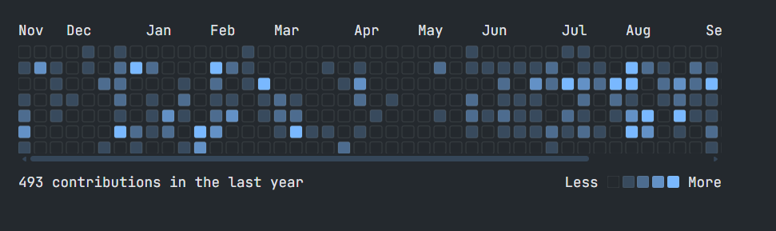
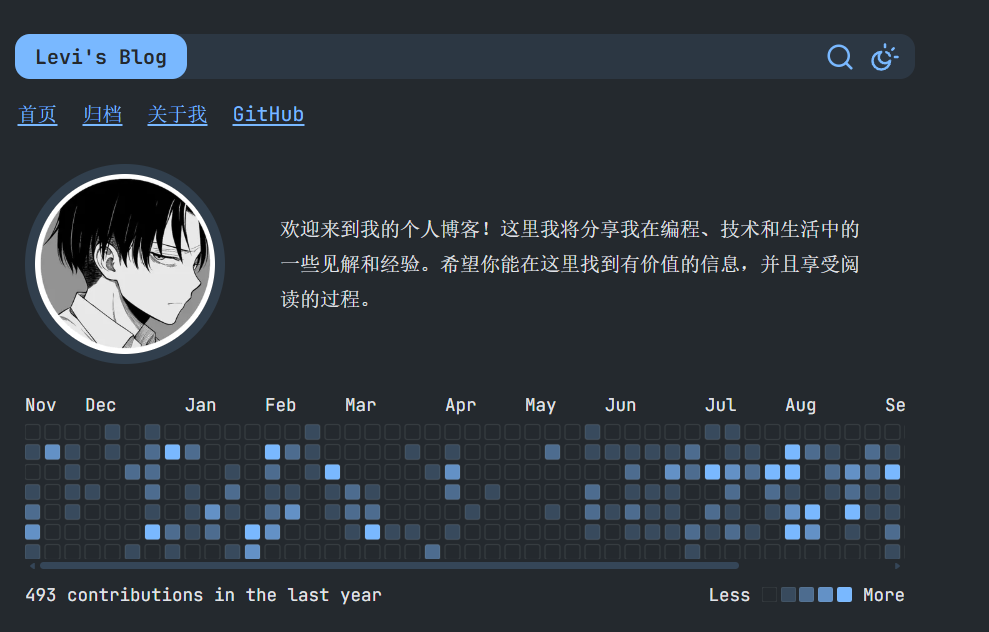
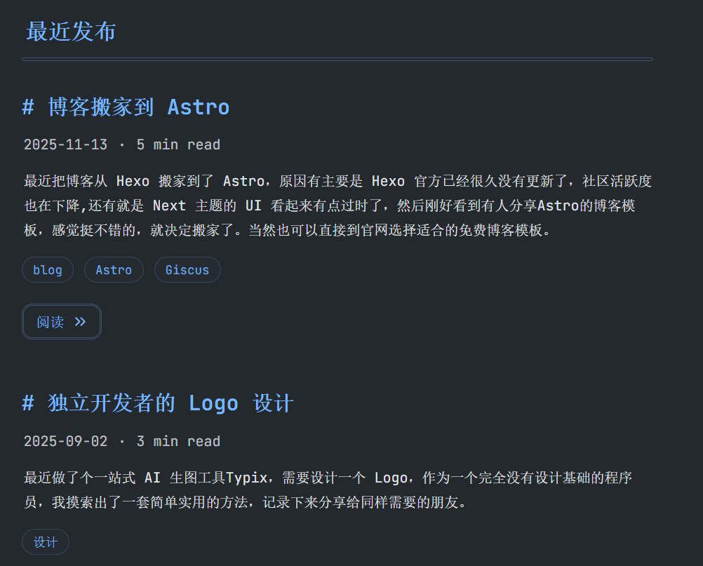
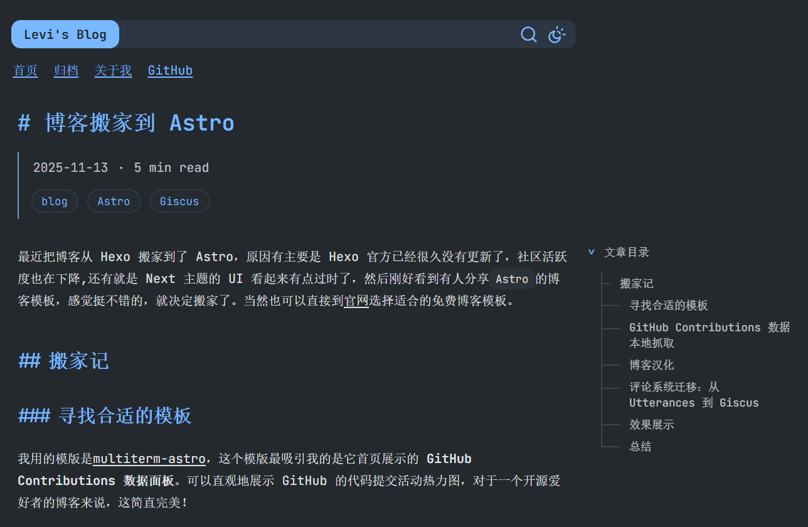

最近把博客从 Hexo 搬家到了 Astro，原因有主要是 Hexo 官方已经很久没有更新了，社区活跃度也在下降,还有就是 Next 主题的 UI 看起来有点过时了，然后刚好看到有人分享`Astro`的博客模板，感觉挺不错的，就决定搬家了。当然也可以直接到[官网](https://astro.build/themes/1/?search=&categories%5B%5D=blog&price%5B%5D=free)选择适合的免费博客模板。

<!--more-->

## 搬家记

### 寻找合适的模板

我用的模版是[multiterm-astro](https://github.com/stelcodes/multiterm-astro)，这个模版最吸引我的是它首页展示的 **GitHub Contributions 数据面板**。可以直观地展示 GitHub 的代码提交活动热力图，对于一个开源爱好者的博客来说，这简直完美！



### GitHub Contributions 数据本地抓取

当我把模板下载下来准备使用时，发现 GitHub Contributions 面板无法正常显示，原因是其依赖的第三方 API 服务已经不可用，然后我就顺藤摸瓜去 GitHub 上搜索相关的开源项目。很快就找到了 [github-contributions-api](https://github.com/grubersjoe/github-contributions-api) 这个开源仓库，然后把它的核心代码直接搬到了我[博客项目](https://github.com/monkeyWie/monkeywie.github.io/blob/master/src/libs/github-contributions-api.ts)里，然后对应的把`GitHubActivityCalendar.astro`组件也更新了，这样就不用依赖任何第三方 API，在本地构建时就能抓取数据了。

### 博客汉化

由于原模板是英文界面，为了更符合中文博客的使用习惯，我对模板进行了全面汉化：

1. **导航栏汉化**：将 "Home"、"Posts"、"Tags" 等改为 "首页"、"文章"、"标签"
2. **页面标题汉化**：如 "All Posts" → "所有文章"、"Read more" → "阅读更多"
3. **日期格式调整**：将英文日期格式改为中文友好的 "YYYY年MM月DD日" 格式
4. **其他细节**：阅读时间、字数统计等提示文字的汉化

### 评论系统迁移：从 Utterances 到 Giscus

之前的 Hexo 博客使用的是 Utterances 作为评论系统，但这次迁移顺便也升级到了更强大的 Giscus。

#### 为什么选择 Giscus？

- ✅ 基于 GitHub Discussions，比 Issues 更适合作为评论系统
- ✅ 支持回复、表情回应等功能
- ✅ 可以自定义主题样式
- ✅ 支持多语言
- ✅ 完全开源免费

#### 迁移步骤

1. **启用 GitHub Discussions**

在 GitHub 仓库设置中启用 Discussions 功能：

- 进入仓库 Settings
- 勾选 Features 下的 "Discussions"

2. **安装 Giscus App**

访问 [Giscus 官网](https://giscus.app/)，按照提示安装 Giscus App 到你的 GitHub 仓库。

3. **获取配置参数**

在 Giscus 官网填写仓库信息后，会生成配置参数：

- `data-repo`: 你的仓库名称
- `data-repo-id`: 仓库 ID
- `data-category`: 讨论分类
- `data-category-id`: 分类 ID

4. **配置站点**

在 `site.config.ts` 中添加 Giscus 配置：

```typescript
export default {
  // ... 其他配置
  giscus: {
    repo: 'username/repo',
    repoId: 'R_xxxxx',
    category: 'Announcements',
    categoryId: 'DIC_xxxxx',
    reactionsEnabled: true,
  },
}
```

5. **从 Utterances 迁移评论**

如果你之前使用的是 Utterances，可以通过 GitHub 的 Issue to Discussion 转换功能来迁移历史评论：

- 进入对应的 Issue
- 点击右侧的 "Convert to discussion"
- 选择对应的 Category

### 效果展示






