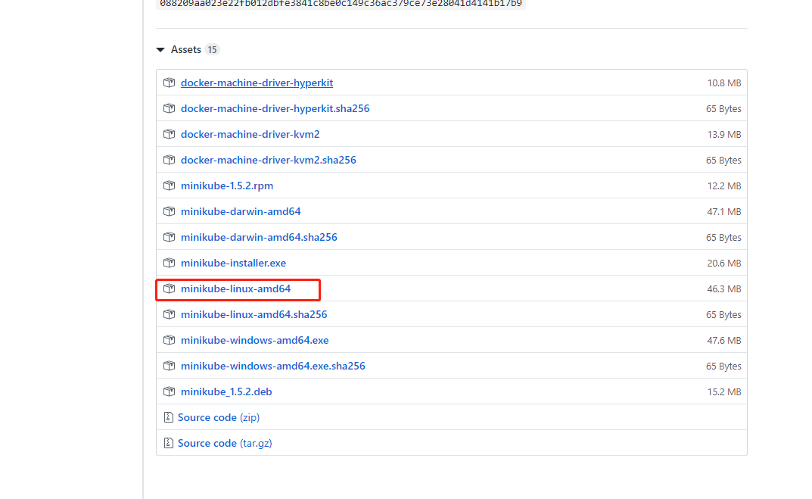

## minikube 介绍

minikube 是 k8s 官方维护的一个单机版的 k8s，通过 minikube 可以很方便的在本地机器上安装一套 k8s 环境用于日常的学习与开发。

## 安装

环境: 虚拟机中的`centos:7`操作系统，其它情况可以参考[官方文档](https://minikube.sigs.k8s.io/docs/start/)，主要步骤都是类似的。

<!--more-->
### kubectl 安装

首先需要先安装 kubectl，用于后续访问 minikube 的 k8s 集群。

```shell
#配置源
cat <<EOF > /etc/yum.repos.d/kubernetes.repo
[kubernetes]
name=Kubernetes
#baseurl=https://packages.cloud.google.com/yum/repos/kubernetes-el7-x86_64
#使用阿里镜像
baseurl=http://mirrors.aliyun.com/kubernetes/yum/repos/kubernetes-el7-x86_64
enabled=1
gpgcheck=1
repo_gpgcheck=1
#gpgkey=https://packages.cloud.google.com/yum/doc/yum-key.gpg https://packages.cloud.google.com/yum/doc/rpm-package-key.gpg
#使用阿里镜像
gpgkey=http://mirrors.aliyun.com/kubernetes/yum/doc/yum-key.gpg http://mirrors.aliyun.com/kubernetes/yum/doc/rpm-package-key.gpg
EOF
#安装kubectl
yum install -y kubectl
```

### docker 配置国内镜像

修改`daemon.json`文件，不存在可以创建一个

```shell
vi /etc/docker/daemon.json
```

加入以下内容：

```json
{
  "registry-mirrors": [
    "https://dockerhub.azk8s.cn",
    "https://reg-mirror.qiniu.com"
  ]
}
```

重启 docker

```
systemctl daemon-reload
systemctl restart docker
```

### minikube 安装

```
curl -Lo minikube https://storage.googleapis.com/minikube/releases/latest/minikube-linux-amd64 \
  && chmod +x minikube
```

由于墙的原因，可以去[`Github Releases`](https://github.com/kubernetes/minikube/releases)页面下载：


下载完之后直接通过命令行启动:

```shell
minikube start --vm-driver=none \
 --image-mirror-country=cn \
 --image-repository=registry.cn-hangzhou.aliyuncs.com/google_containers
```

> 注：--vm-driver=none，是因为本身系统就是在虚拟机中运行的，所以不需要指定虚拟驱动，其它两个选项可以避免国内网络原因导致下载镜像失败。

成功执行之后就可以用`kubectl`进行访问了。
