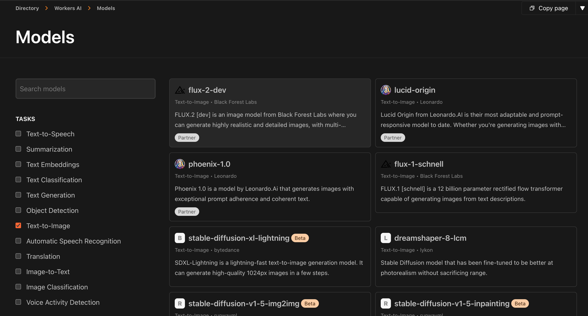
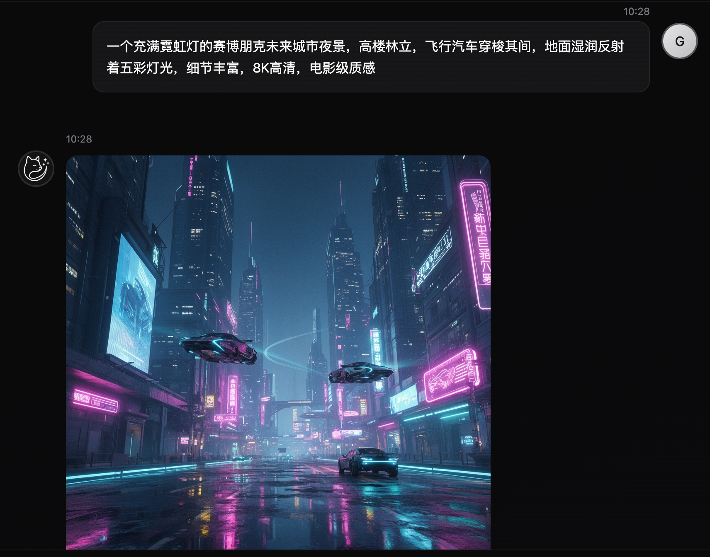
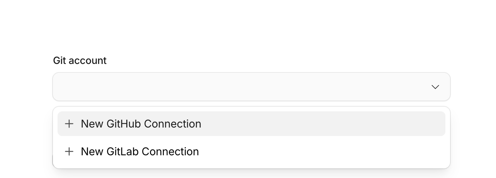
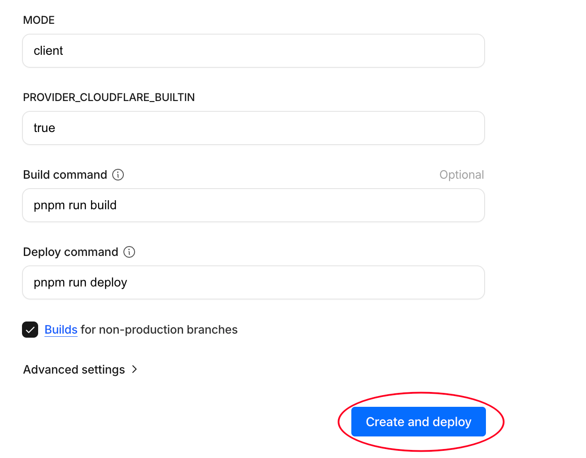
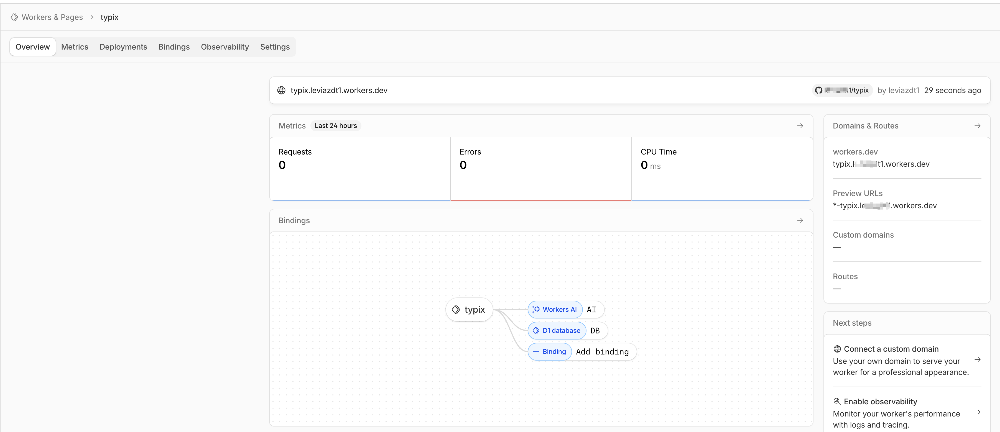
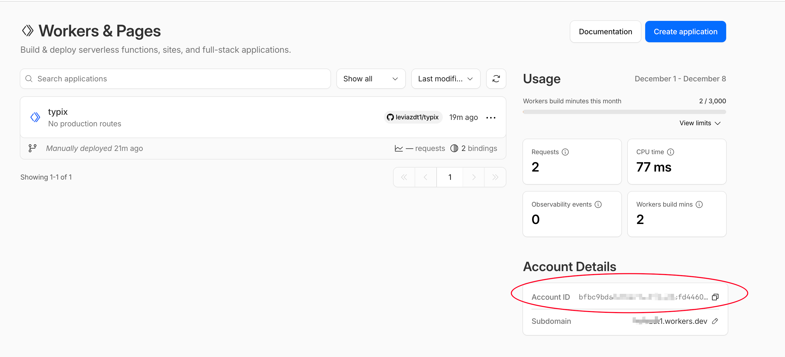
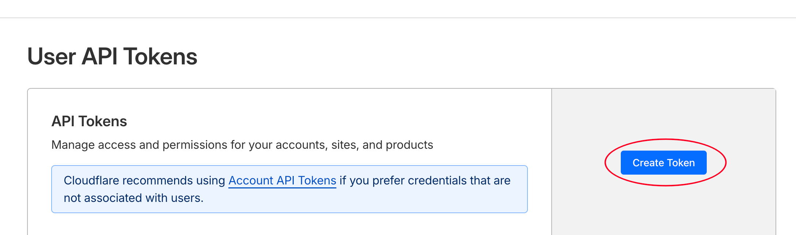
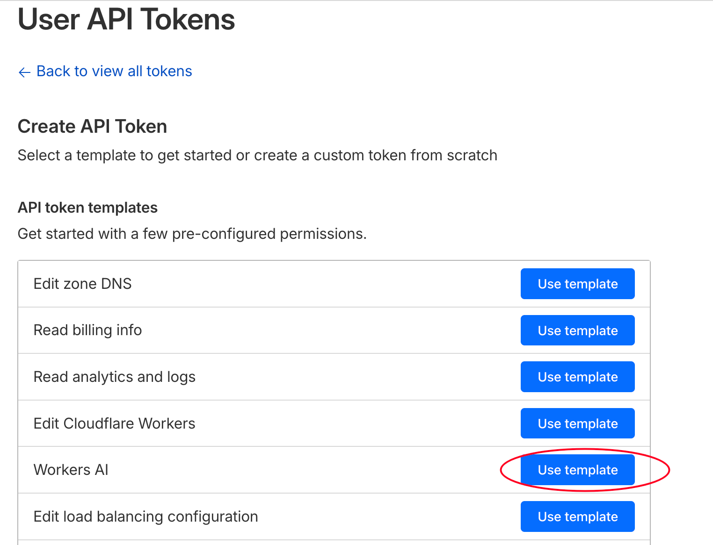
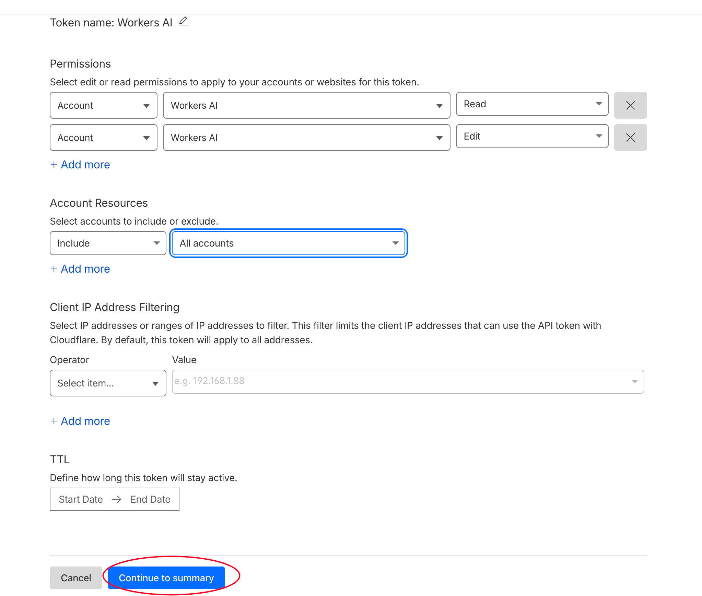
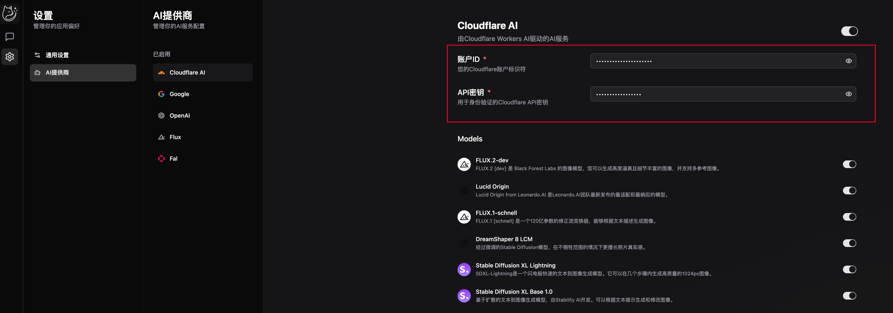

## 前言

你是不是还在为没有显卡或者没有稳定的 AI 生图渠道而烦恼？

最近 Cloudflare Workers AI 推出了 **FLUX.2-dev** 模型，这是一个`32B`参数的生图模型，同时支持`文生图`和`图像编辑`功能。



> 在这之前赛博菩萨也有提供其它模型，例如`lucid`、`flux1`等，但这些模型要么参数量小，要么只能文生图，效果在这个时间点已经不够看了，而最新上架的 FLUX.2-dev 则是目前 Workers AI 里最强的模型，生成效果媲美商业化模型。

## 项目简介

那么如何优雅地~~使用~~白嫖这个 FLUX.2-dev 模型呢？这就请出主角，我的开源新作 **Typix** ！

这是一款专注于 AI 媒体内容生成的开源工具，让你能够轻松调用 Cloudflare Workers AI 和其它主流AI提供商的生图模型，无需复杂配置，支持`一键部署`，开箱即用！更重要的是，它完全免费，让你零成本享受 AI 生图的乐趣。

### 核心特性

- **本地优先** - 数据存储在浏览器本地，无需担心隐私泄露
- **自托管部署** - 完全掌控你的数据和隐私
- **免费生图** - 免费使用 Cloudflare Workers AI 生图，无需付费 API
- **一键部署** - 支持 Cloudflare Workers 和 Docker 快速部署
- **多模型支持** - 集成 Google、OpenAI、Flux、Fal、Cloudflare 等多种 AI 服务
- **云同步** - 可选的云同步功能，在多设备间无缝切换

### 数据安全保障

- **浏览器本地存储** - 基于 WASM SQLite 技术，数据完全存储在你的浏览器
- **零数据上传** - 创作内容、设置信息等敏感数据从不离开你的设备
- **无服务器依赖** - 客户端模式无需外部服务器，保障数据主权

**直接体验**：https://typix.art
**开源地址**：https://github.com/monkeyWie/typix

## 示例展示

以下是一些我测试的示例，大家可以直观感受一下 FLUX.2-dev 的强大能力。

### 文生图示例

#### 示例 1：赛博朋克风格城市

```
一个充满霓虹灯的赛博朋克未来城市夜景，高楼林立，飞行汽车穿梭其间，地面湿润反射着五彩灯光，细节丰富，8K高清，电影级质感
```



#### 示例 2：中国风水墨画

```
中国传统水墨画风格，一位古装仙女站在云端，长发飘逸，身穿白色长裙，周围环绕着仙鹤和祥云，意境唯美，留白艺术，大师级作品
```


#### 示例 3：可爱的 3D 角色

```
3D渲染风格，一只超级可爱的橘猫，圆滚滚的身材，大大的眼睛，毛茸茸的质感，坐在彩色糖果堆上，明亮柔和的灯光，皮克斯动画风格
```


### 图像编辑示例

就拿上面那个橘猫来做个图像编辑的示例吧，我个人觉得一致性和提示词理解能力都非常不错。

#### 示例 1：给橘猫加个帽子

```
在这只橘猫的头上加一顶红色的圣诞帽，帽子上有白色的毛球和毛边，整体风格可爱温馨
```


#### 示例 2：把橘猫换成一只小狗

```
把这只橘猫换成一只可爱的金毛猎犬，保持同样的姿势和背景
```


#### 示例 3: 多图融合

上传一个LOGO图片，然后让模型把它融合到上面的狗狗图片中：

```
把图片2作为LOGO融合到图片1中，放在右上角，保持整体风格一致
```


## 快速部署教程

### Cloudflare Workers 一键部署

这是最简单的部署方式，部署好之后直接享受 Cloudflare AI 的图像生成服务！

#### 前置准备

- Github 账户（必须）
- Cloudflare 账户（可以用 Github 账号登录）

然后点击下面的链接，一键部署 Typix 到你的 Cloudflare Workers：

https://deploy.workers.cloudflare.com/?url=https://github.com/monkeyWie/typix

> 注：国内访问比较慢，建议自备🪜

#### 步骤截图

1. 点击链接后，先选择 Github 账户授权



2. 啥用不用改，拉到最下面，直接部署



3. 等待部署完成



#### 访问地址

部署成功后，你将获得一个 `typix.xxx.workers.dev` 域名，直接访问即可使用 Typix：


> 注：worker.dev 域名在国内无法直接访问，需要🪜，也可以自己买一个域名绑定到 Workers 上，这样就能直连了。

### Docker 部署

说到一键部署，怎么能少了 Docker 呢？下面是通过 Docker 部署 Typix 的方法：

```bash
docker run --name typix -d -p 9999:9999 liwei2633/typix
```

Docker 部署到方式由于不是运行在 Cloudflare Workers 环境上，所以无法直接使用 Workers AI 服务，需要自己配置 API Key，具体配置方法如下：

#### 获取 Workers AI 配置

1. 获取 Account ID，在 Workers & Pages 页面可以看到：



2. 访问 Cloudflare Dashboard，进入 API Tokens 页面创建：https://dash.cloudflare.com/profile/api-tokens



3. 选择 Workers AI 模板



4. 创建 Token 并保存



#### 配置 Typix

上面拿到的两个参数，`Account ID` 和 `API Token`，进入 Typix 提供商设置页面进行配置：



然后就可以愉快地使用 Workers AI 进行图像生成了！

## 后记

Typix 是我个人业余时间开发的开源项目，目的是为创作者提供一个免费、易用且安全的 AI 图像生成工具。如果你觉得这个项目对你有帮助，欢迎给个⭐️支持，也可以参与贡献代码或提出建议！
