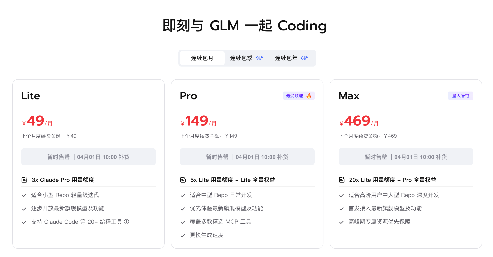
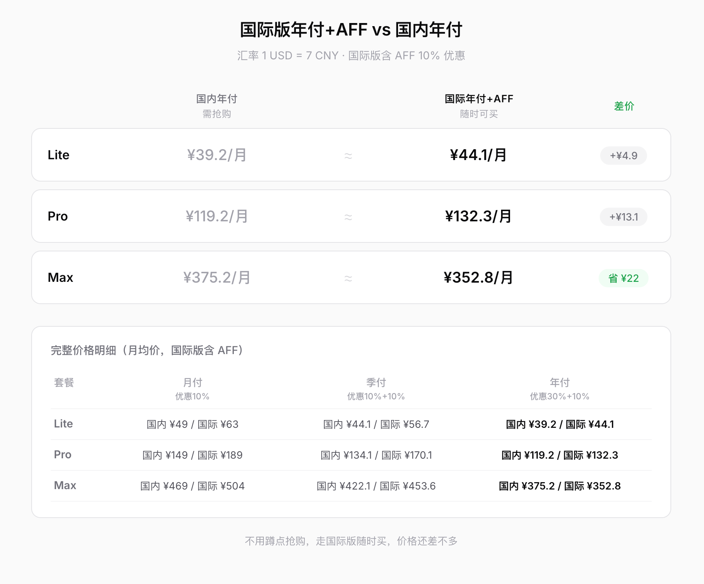
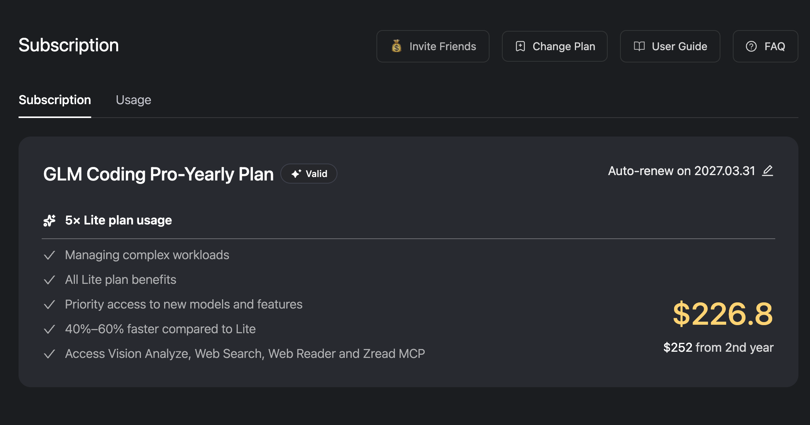
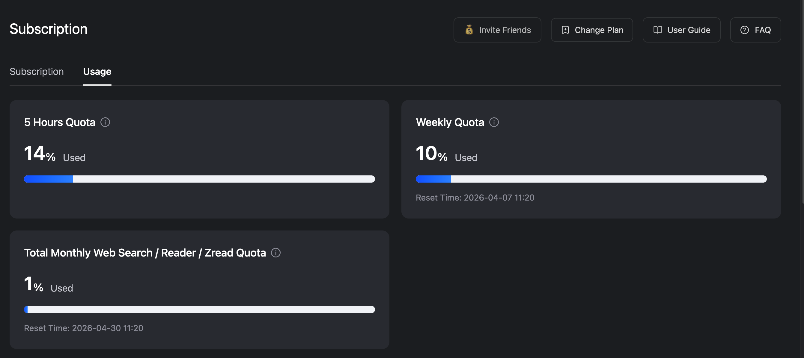

最近智谱发布了 GLM-5.1 模型，网上的评价非常不错，有说比 Claude Opus 4.6 还要强的，也有说大致介于 Sonnet 4.6 和 Opus 4.6 之间的，不管怎么样，我想着**拿来干活肯定是没问题了吧**。

我目前手里有一堆 AI 工具：GitHub Copilot Pro（微软爸爸每个月免费送的）、ChatGPT Plus、Claude Pro，但实际上到了月底，**基本都不够用**，特别是 Claude Pro 属于完全用不了，用 Opus 模型写代码，不到 20 分钟就触发 5 小时 usage limit，所以准备退订`Claude Pro`找个平替，毕竟20刀的`Pro`套餐完全不够用，200刀的套餐又太贵了，刚好这次 GLM-5.1 发布，各方面的反馈都不错，算是来得正好，所以就想开通个`GLM Coding Plan`试试水。

## 问题来了：抢不到啊！

当我兴致勃勃地冲进智谱官网准备开通 GLM Coding Plan 时，发现已经`售罄`了，然后就等第二天开售，定了个闹钟，结果一到10点还是`秒没`，这就是AI时代的经典，钱都得抢着交。

## 通过国际版购买

不过国内抢不到没关系，智谱还有国际版，目前国际版货源充足，随便什么时候都买得到，只不过比国内价格稍微贵一点，毕竟是按美元收费的，但是实际上通过`AFF链接(10%优惠)`+`包年订阅(30%优惠)`的方式购买，折算下来和国内的价格差不多了，甚至更便宜，下面是我计算的一个国内外订阅价格对比：

可以看到，通过国际版年付 + AFF 购买，Pro 折合 ¥132.3/月，和国内季付的 ¥134.1/月几乎一样，Max 甚至更便宜，而且不用抢，随时能买。

> 各位需要购买的朋友可以走我的AFF链接，享受10%优惠：https://z.ai/subscribe?ic=3ZLYGYUJUO

## GLM Coding Plan 体验

我目前开通了 Pro 版本包年订阅，折算下来也就是每个月 20 刀左右，刚好和`Claude Pro`的价格差不多，拿来配合`Claude Code`使用。

体验下来的感觉就是编码能力不错，能一次性解决比较复杂的任务，但是有个非常严重的问题，就是`慢慢慢`，慢到离谱，我那个复杂的任务用了1个多小时才完成。

另外还有个要吐槽的是 GLM 官方宣传的`Pro`套餐额度大约是`Claude Pro`的 15倍，但是我实测下来完全就是虚标，用`GLM5.1`模型跑完一个复杂任务 weekly usage 来到了8%，半天用下来使用量就已经 10%了，按照这个消耗，高强度使用的话完全不够。

体感上大致就是额度略高于`Claude Pro + Claude Code + Opus 4.6`(可能1.5倍到2倍的样子)，约等于`ChatGPT Plus + Codex + GPT 5.4-high`的消耗量，也就是说根本没啥国产模型性价比优势，要不是国外御三家风控严加上付费问题，做个备胎都不够格，同样 20刀的 ChatGPT Plus 无论是模型能力还是速度都是吊打 GLM Coding Plan 的。

## 总结

GLM-5.1 的模型能力确实可以，编码质量没啥大问题，但**速度和用量是两个硬伤**：

- 速度太慢，复杂任务动不动就一小时起步，效率大打折扣
- 实际用量远低于官方宣传，性价比并不像看起来那么高

所以我的建议是：如果你在海外、御三家都能正常用，完全没必要开 GLM Coding Plan；如果你在国内，被风控和付费卡住了，那 GLM 算是一个**能用但不算好用**的备选，别抱太高期望就行。

至于我自己的话，包年都买了，含泪用完吧。
