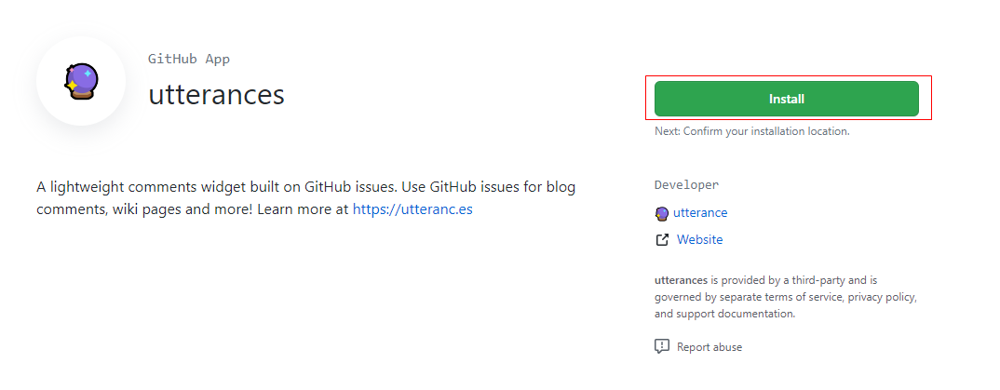

## 为什么升级

最近突然想把博客的评论系统换掉，因为之前用的`valine`评论插件，起初是觉得方便并且可以支持匿名评论，但是在评论之后没有通知，很多评论都是过了很久之后我才知道，所以想换一个能有通知的评论系统，起初的选型是：`Gitment`和`Gitalk`，但是发现一个更好的`utterances`，查了一下 next 高版本已经可以支持`utterances`了，这样升级 next 就直接接入了。

<!--more-->

## 为什么选择 utterances

`utterances`这款评论组件和`Gitalk`、`Gitment`一样都是基于 Github 的 issues 实现的，但是与之不同的是，`Gitalk`、`Gitment`是通过`OAuth Apps`实现的，在使用时会申请评论者对所有公共仓库的读写权限：


就相当于只要评论者在确认授权之后，就可以使用评论者的 github 账号来对公共仓库做任何的事情，这风险是非常高点。

平常我想评论别人博客的时候，在授权时看到上面图片的提示，就会直接放弃评论了，因为无法确定别人网站里会不会偷偷摸摸的做一些坏事，例如：


而`utterances`是通过`Github Apps`实现的，权限粒度划分的很细，可以单独对某个仓库进行授权，并且只对`issues模块授权`：


这样的话安全性就有保障。

## 升级步骤

1. 删除`./themes/next`目录
2. 下载最新版本的`next`主题，这里我使用的`v7.8.0`版本：
   ```sh
   git clone --depth 1 --branch v7.8.0 git@github.com:theme-next/hexo-theme-next.git themes/next
   ```
3. 删除`.git`目录：
   ```sh
   rm -rf themes/next/.git
   ```
4. 修改`themes/next/_config.yml`文件，如果之前有配置或定制一些功能的话需要按照新版本的规范重新设置一次

## utterances 安装

1. 安装`next-utterances`插件

   ```sh
   npm install github:theme-next/hexo-next-utteranc
   ```

   > 注：插件还未发布到 npm 仓库，所以指定从 github 中拉取

2. 安装`next-util`

   ```
   npm install next-util --registry=https://registry.npmjs.org
   ```

   > 注：一定要使用 npm 官方源进行安装，使用淘宝源下载不到，详见：[https://github.com/cnpm/npm.taobao.org/issues/63](https://github.com/cnpm/npm.taobao.org/issues/63)

3. 在 GitHub 上安装`utterances`
   1. 访问：[https://github.com/apps/utterances](https://github.com/apps/utterances)进行安装
      
   2. 授权时只选择存放评论的仓库
      
   3. 修改`themes/next/_config.yml`，添加以下配置：

      ```yaml
      utteranc:
        enable: true
        repo: monkeyWie/monkeywie.github.io
        pathname: pathname
        # theme: github-light,github-dark,github-dark-orange
        theme: github-light
        cdn: https://utteranc.es/client.js
      ```

      > 注：只需要修改`repo`即可

这样就升级完成了，重新部署博客就可以看到评论组件了。


## 后记

最后谈一谈这个组件的缺点：

1. 由于`utteranc.es`网站是国外的，国内访问的时候评论组件加载速度比较慢
2. 如果这个网站关闭走人，那么评论组件就失效了，不过所有评论都存在 GitHub 上，所以数据是不会丢失的
3. 目前该评论组件只支持英文，并且不支持国际化，但是由于内容也不多，所以可以忽略
