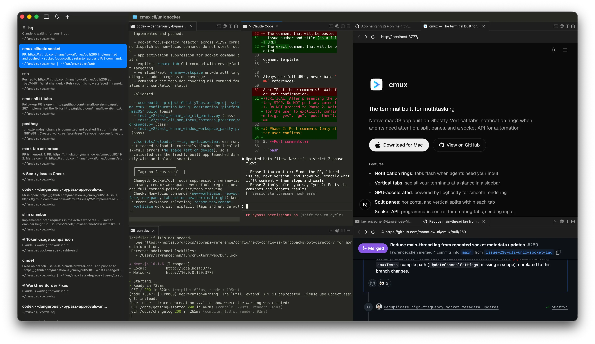
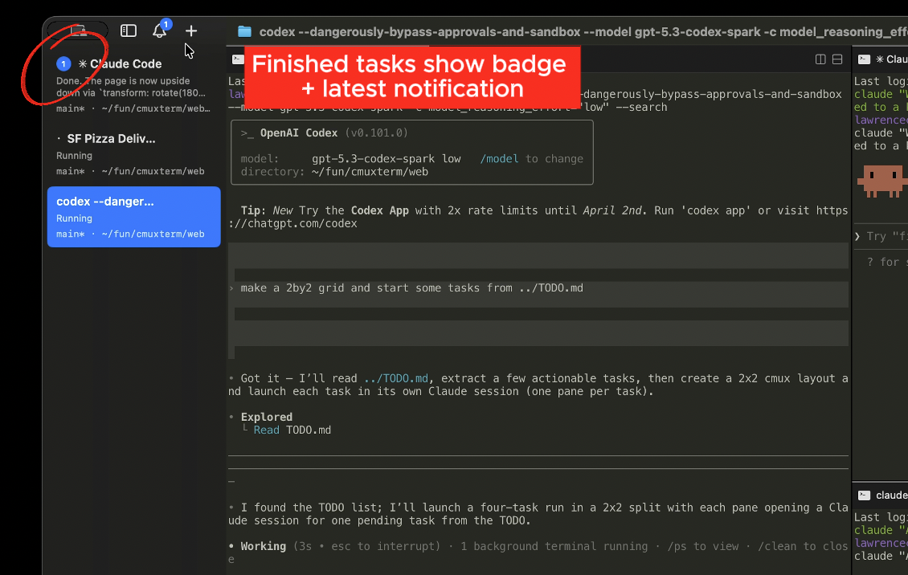
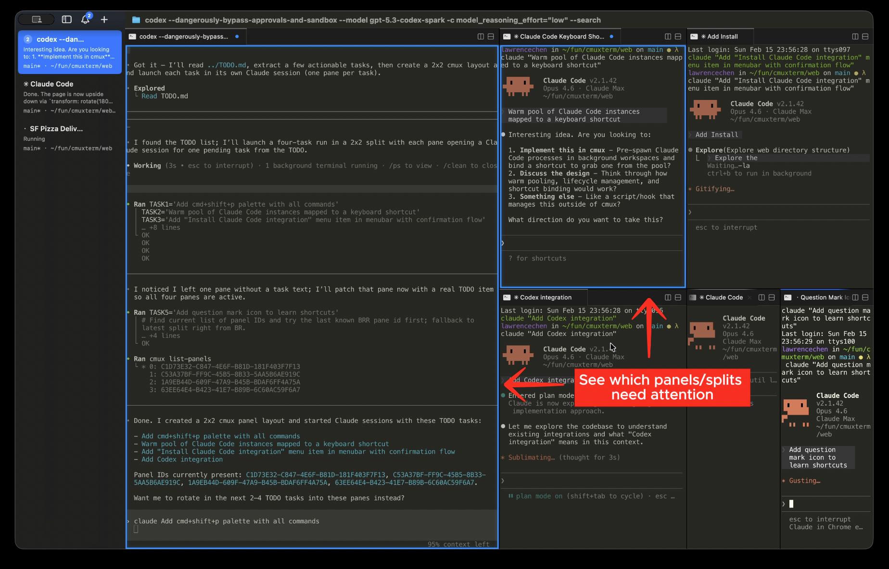
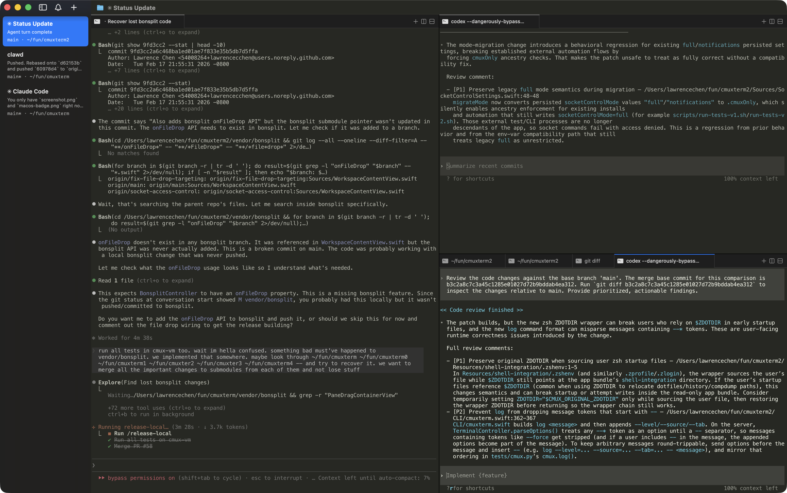
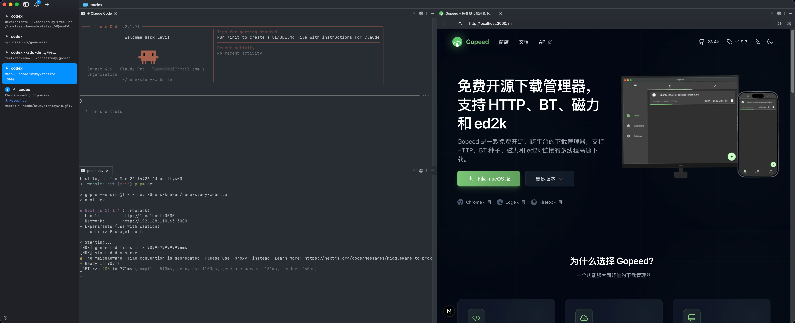
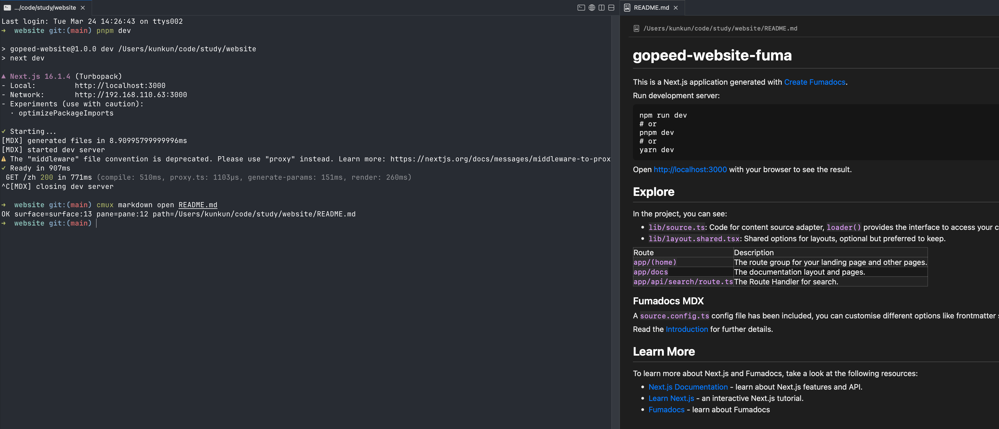

## 混乱的终端

如果你是一个重度 vibe coding 用户，应该对下面这个场景很熟悉。

同时跑着好几个 agent，每个 agent 在推进自己的任务。但问题来了——**agent 占用的终端窗口是不能执行终端命令的**，所以每个项目都得额外开一个或者几个终端窗口来辅助：跑 dev server、跑测试、看日志、执行 git 操作，一个项目大概就要 2-4 个终端窗口。

我平时并行的项目多的时候有 4 个左右，算下来就是 **10 几个终端窗口同时开着**。屏幕上全是杂乱无章堆叠在一起的终端，切来切去效率简直了，而且更折磨人的是 agent 等待确认这件事。agent 做到一半，遇到需要你拍板的问题，它就停在那等着。但你根本不知道它停了——没有精准的跳转，没有明显的提示，得挨个窗口翻过去检查，非常麻烦。

说白了，在AI Agent时代，以前的传统终端工具根本就不够用了。我们需要一个**专门为 AI agent 设计的终端工具**，能让我们同时管理多个 agent 的多个项目，这就是我最近一直在用的 `cmux` 要解决的问题。

---

## cmux 是什么来头

[cmux](https://github.com/manaflow-ai/cmux) 是一个专门为**多 AI agent 并行开发场景**设计的 macOS 原生终端，用 Swift + AppKit 写的，底层渲染引擎直接用了 Ghostty 的 libghostty，GPU 加速，性能非常好。

不是 Electron，不是 Tauri，不是浏览器套壳做的终端。是真正的原生 macOS 应用。

作者造这个东西的原因很直接：他自己在同时跑大量 Claude Code session，现有的终端工具没有一个能告诉他"哪个 agent 现在需要我"，通知系统也没有任何上下文，只是一个无意义的弹窗。他需要的不是又一个功能堆砌的终端，而是**专门为 AI agent 设计的工具**。



---

## 核心功能

### 1. Agent 通知系统

cmux 有一套专门针对 AI coding agent 的通知机制：**当某个 pane 里的 agent 需要你响应时，这个 pane 会亮起蓝色边框，对应的侧边栏 Tab 也会高亮**。不用盯着屏幕，不用担心漏掉，一眼就能看出来谁在等你。

更妙的是，有一个专属的通知面板（`⌘I` 打开），把所有 pending 的通知汇总在一起，按时间排列，点一下直接跳到对应的 pane。如果你想直接跳到最新的未读通知，`⌘⇧U` 一键到位。

用 Claude Code 做 vibe coding 的朋友都懂那种感觉——agent 会时不时停下来问你一句"要不要继续"或者"这里我不确定该怎么处理"。以前这种停顿完全是被动的，你得自己去盯着。现在 cmux 主动告诉你，完全解放了注意力。




### 2. 侧边栏 Tab

cmux 的侧边栏不是普通的 Tab 列表，每个工作区的 Tab 上直接显示：

- **当前 git 分支名**
- **关联的 PR 状态和编号**
- **工作目录**
- **正在监听的端口**
- **最新通知内容摘要**

这意味着什么？你有 5 个工作区在跑，侧边栏一瞥，每个项目的状态全出来了，不用来回切换终端。



### 3. 内置浏览器

cmux 内置了一个基于 WebKit 的浏览器（API 从 Vercel 的 agent-browser 移植过来），可以作为独立 pane 分屏展示在终端旁边。agent 通过 `cmux browser` 命令直接操控：打开 URL、点击元素、填写表单、获取页面快照、执行 JavaScript——全部在终端里完成，你能实时看到浏览器的状态变化。

这个功能结合后面要说的 **cmux-browser skill**，才是真正发挥出全部威力。



> 这也是我觉得目前用的最舒服的地方，上面跑agent，下面开个终端跑`dev server`，右边直接开一个浏览器，直接在终端里打通了调试链路。

### 4. 分屏和工作区

分屏不是新功能，但 cmux 的分屏配合工作区的设计，用起来就是顺手很多。

- `⌘D` 向右分屏，`⌘⇧D` 向下分屏
- `⌘N` 新建工作区，`⌘T` 新建 Tab
- 每个工作区完全独立，自己的通知、自己的侧边栏信息

我现在的标准做法：每个项目一个工作区，工作区内分两个 pane，左边跑 Claude Code，右边留着看日志或者跑 git 操作。多项目并行时，侧边栏排列整齐，切换工作区就是切项目，清晰得不行。


### 5. 无缝继承 Ghostty 配置

如果你之前用 Ghostty，**cmux 默认读取 `~/.config/ghostty/config`**，字体、配色方案、主题，全部自动继承，一行配置都不用动。

如果你不用 Ghostty，也没关系，cmux 本身的默认配置就很好看，拿来即用。

---

## 官方内置 Skills

上面说的那些功能，其实只是 cmux 的"外壳"，是它官方内置了一套 **Skills** 用于操控 cmux，用来更好的结合Agent，以前都是终端器调用Agent，现在Agent也可以调用终端器的能力了，套娃套起来了。

### cmux-browser：终端里直接开浏览器让 agent 调试，这个真的屌炸了

通过这个skill，可以让 agent 通过 `cmux browser` 命令操控内置浏览器，在旁边的 pane 里能实时看到浏览器的状态变化。

具体来说，agent 其实就是调用下面这些命令行：

```bash
# 在终端里打开一个浏览器 pane，访问 dev server
cmux --json browser open http://localhost:3000

# 等页面加载完成
cmux browser surface:7 wait --load-state complete --timeout-ms 15000

# 获取页面的 Accessibility Tree 快照（agent 靠这个"看"页面）
cmux browser surface:7 snapshot --interactive

# 点击某个元素（e1、e2 是快照里的元素引用）
cmux --json browser surface:7 click e2 --snapshot-after

# 填写表单
cmux browser surface:7 fill e1 "test@example.com"

# 等待页面跳转
cmux browser surface:7 wait --url-contains "/dashboard" --timeout-ms 15000

# 执行 JS
cmux browser surface:7 eval "document.title"
```

整个调试流程，agent 自己打开浏览器、自己点页面、自己填表单、自己验证结果，你在终端旁边看着它干活。**不需要配任何额外工具，链路全在 cmux 里**。

还支持各种等待条件，非常适合异步页面：

```bash
# 等待某个元素出现
cmux browser surface:7 wait --selector "#ready" --timeout-ms 10000

# 等待页面出现某段文字
cmux browser surface:7 wait --text "操作成功" --timeout-ms 10000

# 等待 URL 变化
cmux browser surface:7 wait --url-contains "/success" --timeout-ms 10000

# 等待自定义 JS 条件
cmux browser surface:7 wait --function "document.readyState === 'complete'" --timeout-ms 10000
```

以前让 Claude Code 调试前端页面，流程是：写代码 → 你手动开浏览器看 → 截图发给 agent → agent 再改。现在是：写代码 → agent 自己开浏览器看 → agent 自己改。**中间那个人工传递信息的环节消失了**，这才是真正的 vibe coding 闭环。

---

### cmux-markdown：agent 的计划文档实时展示在旁边

这个 skill 简单但极其实用。

Claude Code 在做复杂任务时，会先写一份执行计划。以前这个计划要么打印在终端里被日志冲掉，要么你得自己去翻文件。有了这个 skill，agent 把计划写到一个 `.md` 文件，然后一行命令在旁边 pane 里打开 Markdown 渲染面板，**文件内容更新，面板自动刷新**。

```bash
# agent 先写好计划文件
cat > plan.md << 'EOF'
# 任务计划

## 步骤
1. 分析现有代码结构
2. 实现新功能
3. 补充单元测试
4. 验证构建
EOF

# 在旁边开一个 Markdown 预览面板
cmux markdown open plan.md
```

面板支持完整的 Markdown 渲染：标题、代码块、表格、列表、链接全都有，亮色暗色模式都能适配。agent 执行过程中动态更新 plan.md，面板同步刷新，你随时知道任务跑到哪一步了。

要让 agent 默认用这个能力，在项目的 `AGENTS.md` 里加一句就行：

```markdown
## Plan Display

写计划或任务列表时，先写到 .md 文件，然后用 cmux 打开：
cmux markdown open plan.md
```



---

### cmux（核心控制）：agent 自己编排工作区布局

这个 skill 让 agent 可以直接操控 cmux 的窗口拓扑——创建工作区、分屏、移动 surface、切换焦点，全部通过命令完成：

```bash
# 查看当前布局
cmux identify --json
cmux list-workspaces
cmux list-panes

# 新建工作区 + 分屏
cmux new-workspace
cmux new-split right --panel pane:1

# 把某个 surface 移动到另一个 pane
cmux move-surface --surface surface:7 --pane pane:2 --focus true

# 触发某个 pane 的闪烁提示（agent 用来吸引你注意）
cmux trigger-flash --surface surface:7
```

---

## 完整快捷键一览

| 快捷键 | 功能               |
| ------ | ------------------ |
| `⌘N`   | 新建工作区         |
| `⌘T`   | 新建 Tab / Surface |
| `⌘D`   | 向右分屏           |
| `⌘⇧D`  | 向下分屏           |
| `⌘B`   | 切换侧边栏显示     |
| `⌘I`   | 打开通知面板       |
| `⌘⇧U`  | 跳转到最新未读通知 |

---

## 安装方式

Homebrew 两行搞定：

```bash
brew tap manaflow-ai/cmux
brew install --cask cmux
```

或者去 [GitHub Releases](https://github.com/manaflow-ai/cmux/releases) 下载 DMG，拖进 Applications 文件夹，支持 Sparkle 自动更新，不用手动维护版本。

另外还有 nightly 版本，如果你想第一时间试到新功能，也可以装 nightly，稳定版和 nightly 可以同时安装并行运行。

> 注：cmux 目前只支持 macOS。

---

## 关于它的设计思路

作者在 README 里写了一句话：

> cmux is a primitive, not a solution. It gives you a terminal, a browser, notifications, workspaces, splits, tabs, and a CLI to control all of it.

我挺认同这个思路。它不帮你设计工作流，不告诉你该怎么组织 agent，只把终端、浏览器、通知、工作区这些基础东西做扎实，剩下的你自己决定。对于 vibe coding 这种高度个人化的工作方式来说，"给积木不给图纸"反而更合适。

---

## 写在最后

用了`cmux`大概两周，真的回不去了。

最明显的变化是不需要主动盯着终端了。以前开着 10 几个窗口，要时不时扫一圈看哪个 agent 卡住了，现在 cmux 告诉我，我才去看，其他时间可以专心做别的。
